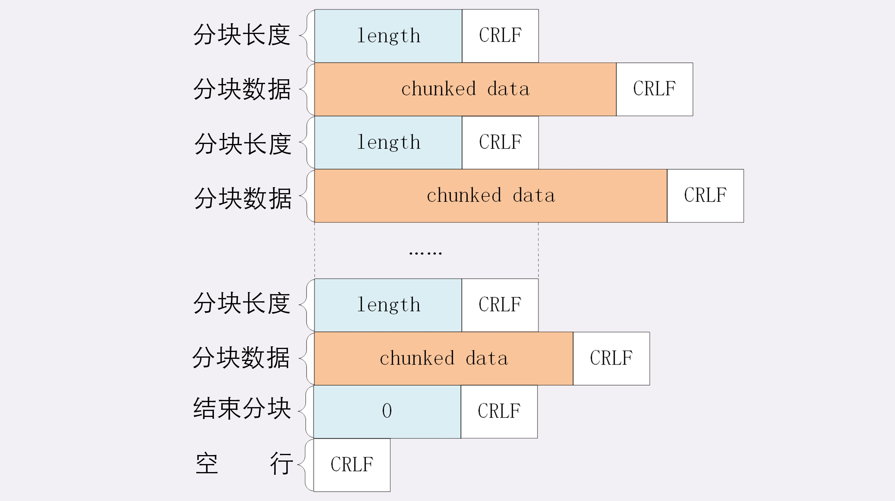
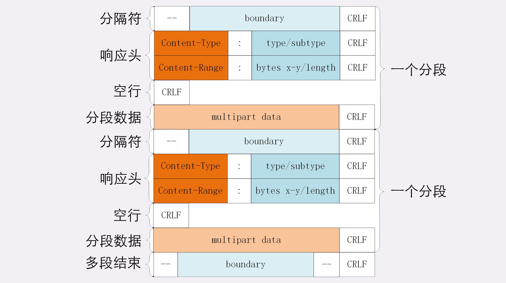

# http大文件传输

> #### HTTP大文件传输有哪些方式 ？

1、**数据压缩**

浏览器在发请求时都会带上 “Accept-Encoding” 头字段， “gzip, deflate, br” 通常是浏览器支持的压缩方式，如果服务器支持的话就会从中选择一种压缩方式放在 “Content-Encoding” 响应头字段里面，把原数据压缩后发给浏览器。

“gzip” 是首选或保底的压缩方式，它对文本类型的数据有较好的压缩率，而对一些本身就是高度压缩的资源：图片、音频、视频等效果不是很好，甚至适得其反。不过我们可以在服务上配置，是他仅仅是对文本类型的资源进行压缩，例如，在 Nginx 里就会使用 gzip on 指令，它是只能指令 ，只会压缩文本数据，不会压缩图片、音频、视频资源

“br” 压缩算法是专门为 HTML 设计的，压缩效率和新能比 gzip 还用好，gzip的压缩率通常能超过60%，而 br 可以在它的基础上提高 20%

2、**分块传输**

压缩是指把大的资源文件整体变小，分块传输是资源文件整体大小不变， 把资源文件拆分成多个小块，然后把这些小块逐个发给浏览器，等所有的小块接收成功后浏览器在组装成复原，这样网络不会被大文件长时间占用，内存、带宽也就节省下来。当然这个过程是在一次的 “请求/应答” 上完成的，不是发送了多个HTTP请求。

“分块传输” 在响应报文头字段里面用 “Transfer-Encoding: chunked” 来表示 ，需要注意的是 在响应头里面 “Transfer-Encoding” 与 “Content-Length” 不能共存的，一个响应报文长度 要么已知（具体的长度），要么是未知（chunked），通常HTTP应答消息中发送的数据是整个发送的，“Content-Length” 头字段表示响应数据的长度，然而使用分块传输，数据分解成一系列数据块，并以一个或多个块发送，这样服务器可以发送数据而不需要预先知道发送内容的总大小。当然 “Transfer-Encoding” 头字段的值也可以是 “gzip、deflate” 表示传输时使用的是压缩编码

下面我们看下分块传输报文的结构图：



根据上图得出：

1、每个分块包含连个部分，长度头 和 数据块 

2、长度头是以 CRLF（\r\n 换行符）结尾，长度用16进制数字表示

3、数据块紧跟在长度头后面，以 CRLF（\r\n 换行符）结尾 ， 但数据不包含换行符

4、最后一个长度为 0 以 CRLF（\r\n 换行符）结尾，下面又是一个  CRLF（\r\n 换行符）

3、**范围请求**

“范围请求” HTTP可以针对于超大的文件进行某一部分的请求，获取文件的某一部分，其实这种问题生活中也经常遇到，例如 看电影、电视剧等可以拖动进度条快进等，这实际就是获取大文件其中的片段数据，与分块传输有本质的区别。

范围请求不是服务器端必备的功能，所以服务器必须在响应头上使用 “**Accept-Range:bytes**” 明确告知客户端支持访问请求，

HTTP协议规定在请求头使用 “**Range:bytes=x-y**” 字段表示 “范围请求”

其中 x、y 以字节为单位表示是 “偏移量” ，范围必须从 0 计算，比如：前10个字节用 “bytes=0-9” 表示从0开始偏移9个字节，第二个 10 个字节用 “bytes=10-19” 表示

**其实 Range 的表示格式很灵活，x、y 都是可以省略的，假设文件的大小是 100 个字节，那么：**

1、“0-”  表示从第 0 个字节开到末尾字节 ，表示整个文件的大小

2、“10-” 表示从第 10 个字节开到末尾字节

3、“-1” 表示文件的最后一个字节

4、“-10” 表示从倒数第10个字节开始到末尾字节

**服务器检测到 “Range” 头字段之后，要做如下4件事**

1、必须检查范围是否合法，否则有范围有越界的可能，如果服务器返回 “**416**” 的状态码，就表示请求的文件范围有问题

2、如果范围正确，服务器就可以根据 “Range” 头字段计算偏移量，然后读取文件片段，返回 “**206 Partial Content**” 状态码，表示 body 只是原数据的一部分

3、除此之外，服务器还要添加一个响应头字段 “**Content-Range:x-y/length**” 告诉客户端返回的数据的范围与资源文件的总大小

4、这些都准备好之后就是直接把片段数据用TCP发送给客户端，一个范围请求处理完毕

请求头：

```text
GET /16-2 HTTP/1.1
Host: www.chrono.com
Range: bytes=0-31
```

响应头：

```text
HTTP/1.1 206 Partial Content
Content-Length: 32
Accept-Ranges: bytes
Content-Range: bytes 0-31/96
```

有了这些访问请求之后，HTTP处理大文件就更加得心应手，看视频可以根据具体的时间点计算出文件的 Range 不用下载整个文件，可以精确的获取资源文件的片段。常用下载工具里的 “多段下载”、“断点续传” 是基于它实现的，主要的实现要点：

1、**先发个 “HEAD” 请求 ，看服务器是否支持范围请求，同时获取文件的大小**

2、开 N 个线程，每个线程使用 “Range” 字段划分出各自负责的下载片段，发请求传输数据

3、下载意外中断也不怕，不必重头再来一边遍，只要根据上次的下载记录，用 Range 请求剩下的那一部分就好


4、**多段范围请求**

上面讲到的范围请求表示的请求 “一个片段” ，其实 HTTP 还可以支持一次请求 “多个片段”，具体的操作如下：

1、在请求头的 “Range” 字段新增多个片段，如：“**Range: bytes=0-9, 20-29**”

2、响应头的 “Content-Type” 字段值就变成了 “**multipart/byteranges; boundary=xxxxxxx**”  如：“**Content-Type: multipart/byteranges; boundary=00000000001**”

具体示例

请求头：

```text
GET /16-2 HTTP/1.1
Host: www.chrono.com
Range: bytes=0-9, 20-29
```

响应头：

```text
HTTP/1.1 206 Partial Content
Content-Type: multipart/byteranges; boundary=00000000001
Content-Length: 189
Connection: keep-alive
Accept-Ranges: bytes

--00000000001
Content-Type: text/plain
Content-Range: bytes 0-9/96

--00000000001
Content-Type: text/plain
Content-Range: bytes 20-29/96

ext json d
--00000000001--
```

报文格式图：




