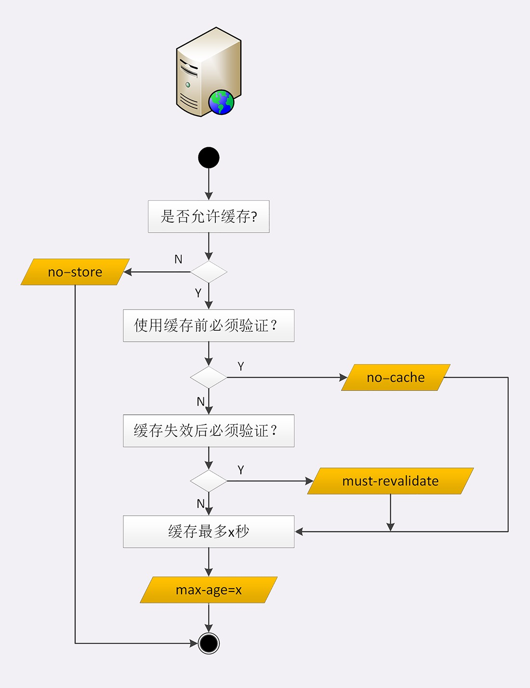

# HTTP的缓存控制

> #### “Cache-Control” 头字段的属性

“**Cache-Control**” 有如下几个属性值：

“**max-age=xxx**” 表示资源的有效时间，这个时间如果是服务器端设置的就从创建报文的时间开始计算，例如：服务器设置的是15秒（“max-age=15” ），可能在传输的过程中就浪费了2秒，实际在客户端的生效时间就是13秒。

“**no-store**” 表示不允许设置缓存，通常用于某些变化频繁的资源

“**no-cache**” 表示每次使用缓存前必须要去服务器检查是否有最新版本，没有则使用缓存，有则获取最新版本

“**no-revalidate**” 表示有效时间内可以继续使用，一旦过期了如果还想使用就必须去服务器验证

> #### “Cache-Control” 头字段的使用

**“Cache-Control” 响应头字段 在服务器端设置**：

1、浏览器发现资源没有缓存，于是发生请求向服务器获取资源

2、服务器响应请求，并且在响应设置 “Cache-Control: max-age=20”

3、浏览器缓存资源，下次如果在有效期内（30 - 报文传输时间）重复请求该资源浏览器则优先使用缓存资源

**“Cache-Control” 响应头字段 在客户端设置**：

1、在浏览器点击 “刷新” 按钮的时候，浏览器会在请求头添加 “Cache-Control: max-age=0” 表示要去服务器获取最新资源，不管该资源是否有缓存，但是如果有 “if” 条件请求，就会忽略 “Cache-Control: max-age=0” ，按条件请求的缓存处理，如果条件请求有效就是返回 304 的状态码

2、按 “Ctrl+F5” 强制刷新时候，浏览器会在请求头添加 “Cache-Control: no-cache” 其实也是表示获取最新的资源，不管是否有 “if” 条件请求，浏览器都会忽略掉，返回的是 200 的状态码

3、在浏览器点击 “前进”、“后退” 按钮的时候，浏览器压根就不设置 “Cache-Control” 头字段，打开发者工具 在 “Status Code” 头字段上你会惊喜的发现 “from disk cache”，意思是压根就没有走网络请求，直接使用缓存

> #### 条件请求

<!-- 通过对 “Cache-Control” 头字段的分析发现它对缓存的控制并不是很实用，又因为缓存会失效、使用前必须去检查服务器是否有新版本（两次请求浪费资源）等原因，所以 HTTP 协议就定义了一系列 “if” 开头的 “条件请求” 头字段，专门用来检查资源是否有过期，把验证的过程交给服务器，提高使用效率。 -->

浏览器用 “Cache-Control” 做缓存控制只能是刷新数据，不能很好地利用缓存数据，又因为缓存会失效，使用前还必须要去服务器验证是否是最新版本。基于这样的情况你可能会说：先发个HEAD请求，获取资源的修改等元信息，然后有缓存数据比较是否有更新，没有就使用缓存，否则就个请求获取最新的版本。

话这样说没有错，但是这无疑成本太高，为了做这样的缓存每次要走一次网络请求，然后还要检查资源是否有更新（**客户端做的**），有更新的情况还要再走一次网络请求。那有没有一种两全其美的办法，把检查验证是否有更新的活放在服务端，并且走一次网络请求的方法呢 ？答案是肯定的

于是 HTTP 协议就提出了一系列的 “**if**” 开头的 **条件请求** 头字段， **条件请求** 需要 第一次请求资源的时候返回 “**Last-modified**” , “**ETag**” 头字段，下次 请求的时候在 “**条件请求**” 头字段上带上相应的 “**Last-modified**” , “**ETag**” 的值，服务器用这个值来检查验证请求资源是否有更新，没有则返回 304 状态码，有则返回最新的资源文件。

“**Last-modified**” 表示资源文件的最后修改时间，通常是以秒为单位，无法精确到秒内改动多次这种情况

“**ETag**” 是 “实体标签（Entity Tag）” 的缩写，表示资源唯一的标识值，资源一旦有变化这个值就会发生变化，精确度比 “Last-modified” 高

1、“**if-Modified-Since: Last-modified**” 表示请求匹配服务器上 “Last-modified” 之后有修改的资源文件

2、“**If-Unmodified-Since：Last-modified**” 表示请求匹配服务器上 “Last-modified” 之后没有修改的资源文件

3、“**if-Match: ETag**” 表示请求匹配服务器上 ETag 为 “ETag” 的资源文件

4、“**if-None-Match: ETag**” 表示请求匹配服务器上 ETag 不为 “ETag” 的资源文件

5、“**if-Range: Condition**” 表示当字段值中的 “Condition” 得到满足时，Range 头字段才会起作用，同时服务器回复 206 部分内容状态码，以及Range 头字段请求的相应部分；如果字段值中的 “Condition” 没有得到满足，服务器将会返回 200 OK 状态码，并返回完整的请求资源。“Condition” 可以是 “Last-modified”、“ETag” 其中一个，都不能两者同时出现

这5个 if 开头的条件请求头字段，其中以 “**if-Modified-Since**” 、“**if-None-Match**” 最为常用，且 “**if-None-Match**” 的优先级比 “**if-Modified-Since**” 高。 

**举个例子：浏览器带上 “if-None-Match: 123abc” 头字段向 index.html 文件发起请求（123abc为ETag）：**

**意图**：浏览器请求 “**ETag**” 不是 “**123abc**” 的 index.html 文件：

**结果1**：没有 “**ETag**不是**123abc**的index.html文件”，也就是说 “只有ETag为123abc的index.html的文件”，这时服务器只能返回没有主体的 304 状态码，浏览器接收到 304 状态码之后，就会使用缓存的index.html文件

**结果2**：有 “ETag为**456efg**的 index.html文件” , 这就是说 index.html 已经更新了 ，这个时候服务器应该是返回 “ETag” 为 “456efg” 的 index.html 文件，状态码为 200

**ETag 还有 “强” “弱” 之分：** 

“**强ETag**” 要求资源在 “字节级别” 必须完全相符

“**弱ETag**” 在值前有个 “W/” 标记，只要求资源在语义上没有变化，但内部可能有部分改变（如：html标签顺序调整，或多了几个空格等）

> #### “Expries” 头字段

除了 “Cache-Control” 头字段，服务器也可以使用 “Expires” 字段来标记资源的有效期，表示 “过期” 时间，它是一个绝对时间，优先级低于 “Cache-Control” 。此外还有一个历史遗留头字段 “Pragma: no-cache” , 它相当于 “Cache-Control: no-cache” , 除非是为了兼容 HTTP/1.0 否则不建议使用