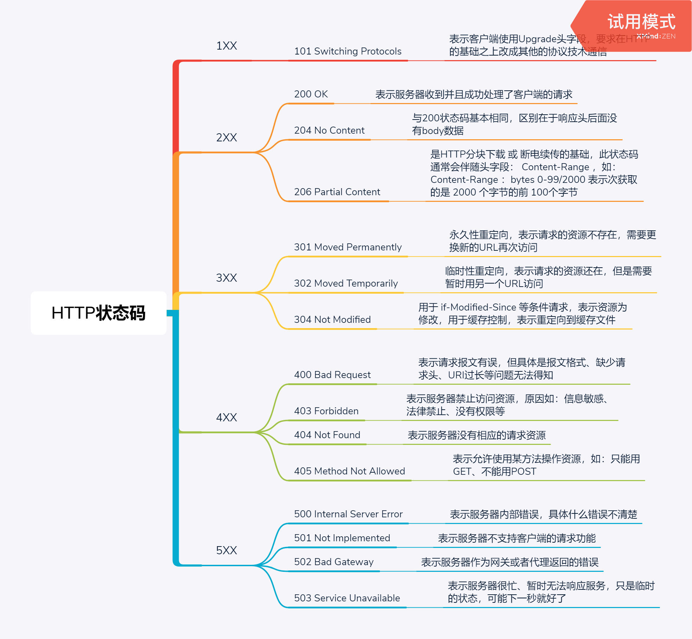

# HTTP状态码

> #### HTTP状态码的范围

HTTP状态码是由3个数字组成 “100 ~ 999” ，RFC标准把状态码分成5个类别，从小到大实际范围就是 “100 ~ 599”，但是具体使用的总共有41个状态码，但是状态码的定义是开放的，可以自行定义

> #### HTTP状态码的意义

HTTP状态码是意义在于服务器对客户端请求处理的结果或状态，客户端可以根据这状态做下一步的操作，比如：重定向、切换协议、继续请求等

5个类别的状态码含义如下：

1、**1XX** ：提示信息，表示目前协议处理的中间状态，还需进行后续操作

2、**2XX** ：请求成功，表示服务器已经收到请求报文，并且已经处理了请求

3、**3XX** ：重定向，表示请求的资源位置发生变动，需求客户端重新发送请求

4、**4XX** ：客户端错误，表示请求的报文有误，服务器无法处理请求

5、**5XX** ：服务器错误，表示服务器在处理请求时内部发生了错误

常见错误码：

