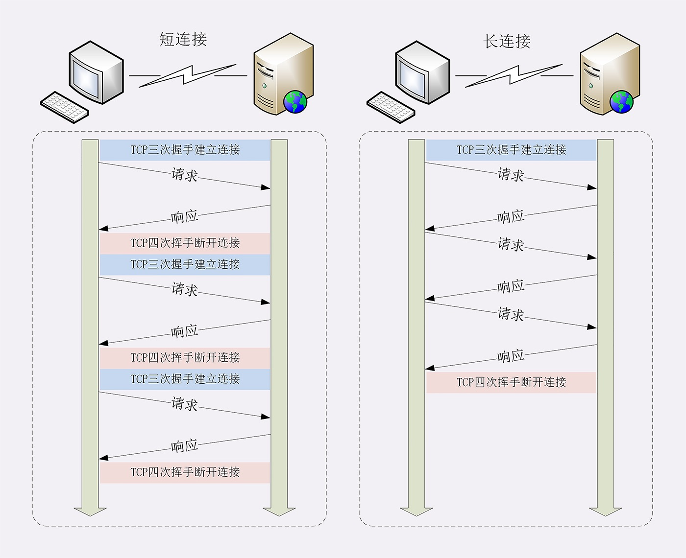

# http链接管理

> #### 短链接

“短链接” 表示客户端与服务器端的整个连接过程很短暂，不会与服务器保持长时间的的连接状态。

HTTP协议在初期（0.9、1.1版本）是一个比较简单的协议，它底层数据传输基于TCP/IP，客户端每次发送请求前需要与服务器建立连接，收到服务器响应的报文之后立马关闭连接

由于每次请求前都需要建立连接，但是在TCP协议里面建立连接、关闭连接都是非常浪费时间的，从用户角度这严重影响了用户体验，从服务器的角度严重制约了服务器的能力，导致它无法处理更多的请求。随着互联网的发展每次请求都需要做重复建立关闭连接操作这一缺点逐渐暴露出来。

在TCP协议里面建立、关闭连接是非常的 “昂贵” 的操作：

1、TCP建立连接需要 “3次握手”，发送3个数据包，1个RTT

2、TCP关闭连接需要 “4次挥手”，发送4个数据包，2个RTT

RTT 表示一个数据包从发出去到回来的时间，而一个正常的 HTTP 请求是发送4个数据包，2个RTT，所以单单从时间角度考虑，建立关闭连接就浪费了60%（3/5 = 60%）的时间

> #### 长链接

针对 “短连接” 这一缺点，在 HTTP1.1 上就提出了 “长连接” 的 的方案，所谓“长连接”就是在 “特定的时间” 或者 “特定的连接次数” 内不关闭连接，这样HTTP每次请求就省去了建立、关闭连接的时间，从而提高访问效率。

如下图：

由于 “长连接” 对性能的改善效果非常显著，所以 “**HTTP 1.1**” 版本默认都会开启长连接，不需要人为的去设置 “**Connection: keep-live**” 头字段（人为设置也是允许的），只要服务器支持长连接，那么客户端在第一次请求时候，服务器响应头里面都会带上“**Connection: keep-live**” 表示支持长连接，后续向服务器发起请求都会重复利用第一次请求打开的TCP连接

当然 “长连接” 的长到什么时候，这又是一个需要解决的问题，否则大量的 “长连接” 只连不发，就会占用、浪费服务资源，导致服务器无法为真正有需要的用户提供服务

**服务器通常不会关闭 “长连接”，但是可以使用一些策略来解决这个问题：**

1、客户端可以明确的协商关闭 “长连接”，比如：在请求头里面加上 “Connection: close” 字段，服务器看到这个字段之后就明白客户端有关闭连接的意图，然后会在响应头加上 “Connection: close”，发送之后就会调用 Socket API 关闭 TCP连接

2、在Nginx上使用 “keepalive_timeout” 指令，设置长连接有效期，如果在一段时间内连接没有任何数据的收发就主动断开连接，避免空闲连接占用服务资源

3、在Nginx上使用 “keepalive_requests” 指令，设置连接可发送的最大请求次数，那么当最大请求次数达到请求上限之后就主动断开连接

> #### 队头阻塞（Head-of-line blocking）

“队头阻塞” 与短连接和长连接没有关系，是由 HTTP 的 “请求/应答” 模式造成的，HTTP 的 “请求/应答” 模式，其实就一个请求的队列，具备了 “先进先出” 的特点，没有轻重缓急之分，如果一个客户端请求服务器需要很长的时间才能响应，那么这段时间之内整个请求队列就会阻塞

**HTTP协议的 “请求/应答” 模式要推翻目前来看基本是不可能，既然模式不能改变，可以从如下方面去缓解这个问题：**

1、“并发连接” 就是同时对一个域名发起多个 “长连接” ，但是 “并发连接” 的数量是一个值得关注的问题，如果不加以限制那么每个客户端都建立很多长连接，用户量一庞大，服务器是没法扛的，所以 HTTP协议 建议 客户端使用并发 而不 “滥用” 并发。目前市面上的浏览器基本都可以并发 6 到 8 左右

2、“域名分片” 就提供多个域名指向同一个服务从而来提个 “并发连接” 的数量。HTTP协议与浏览器限制了同一个域名下的并发连接数量，但是它无法限制域名数量，只要服务器能扛得住，可以使用多个域名指向同一个服务，这样就通过域名的数量来提高“并发连接”

