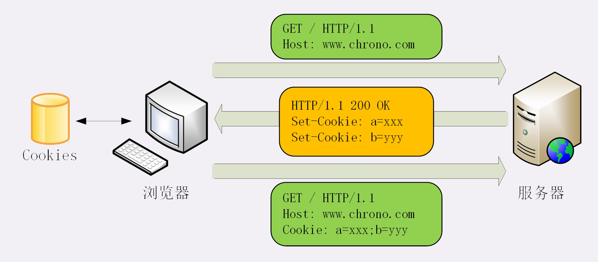
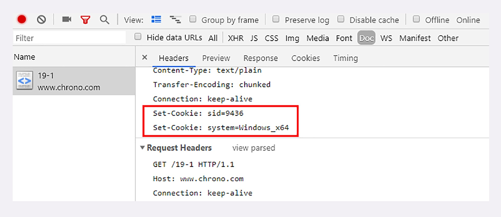

# HTTP的Cookie机制

HTTP协议是 “无状态” 的，这个特点是一把双刃剑，优点是服务器没有状态差异，可以很容易的组成服务集群，缺点是无法支持需要记录状态的事物操作。

HTTP协议是 “无状态” 的，只要请求处理完毕断开连接它就是忘的一干二净，不管上次请求你做了啥，下次请求它还是很热情的招待，因为它压根就不知道你是谁了，但是偏偏有些操作业务就是要你记住下次请求是谁才能继续操作下去，比如：网上论坛、电商购物等都需要 “看客下菜”，只有知道了用户的身份才能发帖、下订单等一系列的会话事务。这时Cookie就出现了，它可以帮你做到这一点。

HTTP协议是 “简单、灵活、可扩展” 的，还有什么是添加请求头字段不能做到的呢 ？不就是给HTTP添加 “记忆能力” 而已嘛。

> #### Cookie是什么 ？

“**Cookie**” 其实就是 HTTP协议里面的一个 “**特殊**” 的请求头字段，头字段里面通常保存的是一些服务器才能理解的数据（也就是说通常数据是来自服务器），HTTP协议有个特点就是每次请求都会把请求头字段带上发给服务器，由此服务器也就可以通过 “**Cookie**” 头字段的数据识别出客户端身份（客户端代理的用户）

> #### Cookie实现过程 ？

当用户打开浏览器第一次访问服务器的时候，服务器肯定是不知道他的身份的，所以服务器就要创建一份用来标识身份的数据，然后以 “**key=value**” 的形式(注意多个key=value用“;”分隔)放入响应头字段 “**Set-Cookie**” 里面去，字段就会随着响应报文一同发给浏览器。

浏览器接受到报文，看到响应头里面有 “**Set-Cookie**” 头字段，就会把 “**Set-Cookie**” 的值保存起来，浏览器下次请求的时候会自动把这个值放到 “Cookie” 响应头字段里面去，随着请求报文一同发送到服务器，这样服务器就可以拿 “**Cookie**” 响应头字段识别浏览器的身份了。

当然随着业务越来越复杂你可以设置其他的字段到 “**Set-Cookie**”响应头字段里面 或者 你一次性可以设置多个 “**Set-Cookie**” 响应头字段，浏览器都会把相应的值放到同一个 “**Cookie**” 里面（存储多个key=value用“;”分隔），随着请求报文一同发送到服务器，通常 “**Cookie**” 保存的数据最多是 4KB 左右

如下面的的流程图：

> #### Cookie 的属性 ？

既然服务器都把**身份标识**等的数据交给 “**Cookie**” 保管，“**Cookie**” 总要做些措施来保护这些数据的安全，要不然实在是愧对服务器对自己的信任

1、**设置 “Cookie” 的生命周期**

让 “**Cookie**” 在一段时间内有效，一旦过了有效期浏览器认为 “**Cookie**” 已失效，会在存储里删除，同时也不会发送给服务器

通过 “**Max-Age**” 属性设置，它用的是相对时间，以秒为单位，浏览器用收到报文的时间点加上 “Max-Age” 就可以得到失效的绝对时间

通过 “**Expires**” 属性设置，它用的是绝对时间，可以理解为 “截止日期”

“Max-Age” 的优先级高于 “Expires” ，如果连个同时设置浏览器会有些采用 “Max-Age”，如果 “Max-Age” 设置为 0 ，表示立即失效，如果不设置那么只在浏览器运行种有效，浏览器一关闭 “**Cookie**” 立即失效，称为 “会话 Cookie”（Session Cookie），否则 “有效期” 就根据设置的时间来定，就算浏览器已经关闭了下次打开如果还在有效期 “**Cookie**” 仍然有效

2、**设置 “Cookie” 的作用域**

设置 “**Cookie**” 的作用域，让浏览器仅发送给特定的服务器和URI，避免被其他的网站盗用

通过设置 “**Domain**” 和 “**Path**” 指定 “**Cookie**” 所属的域名和路径，浏览器会在发送 “**Cookie**” 前从 URI 中提取 “**host**” 和 “**path**” 与 设定的“**Domain**” 和 “**Path**” 进行对比，如果不满足条件就不会在请求头里面发送 “Cookie”

现实中为了省事通常是设置 “**path**” 为 “**/**” 或者 直接不设置 ，表示该域名下的任意路径都允许使用 “**Cookie**”

3、**设置 “Cookie” 的安全性**

设置 “Cookie” 的安全性，尽量不让外界读取、篡改 “Cookie”

前端同学应该知道，JS脚本可以用 doument.cookie 来读写 “Cookie” 数据，这样就可能会导致 “跨站脚本”（XSS）攻击窃取数据

通过 “**HttpOnly**” 属性设置，告诉浏览器此 “Cookie” 只能通过浏览器 HTTP 协议传输，这样浏览器引擎就会禁用一切方式访问，脚本攻击也就无从谈起

通过 “**SameSite**” 属性设置，可以防范 “跨站请求伪造”（XSRF）攻击，设置 “SameSite=Strict” 可以严格限制 “Cookie” 不能随着跳转连接跨站发送，而 “SameSite=Lax” 就稍微宽松一点，允许 “GET/HEAD” 等安全方法发送，但禁止 “POST” 跨站发送 

通过 “**Secure=true**” 属性设置，表示 “Cookie” 仅能用 “https” 协议加密传输，明文的HTTP协议会禁止发送，但 “Cookie” 本身不是加密的，在浏览器中还是会以明文的形式存在 

> #### Cookie 的应用

1、“Cookie” 最基本的一个用途就是 “**身份识别**” ，保存用户的登录信息、实现会话事务

2、“Cookie” 另外一个用途是 “**广告跟踪**”

> #### Cookie 的缺点

1、存在安全隐患, 由于 “Cookie” 是明文的保存在客户端，一旦被他人获取就有存在被冒名顶替的风险

2、“Cookie” 有数量和存储大小限制，一般是不超过 4 KB，不宜存储 “Cookie” 过大，否则每次请求都要带上浪费请求资源

3、前端浏览器可以禁用 “Cookies”

