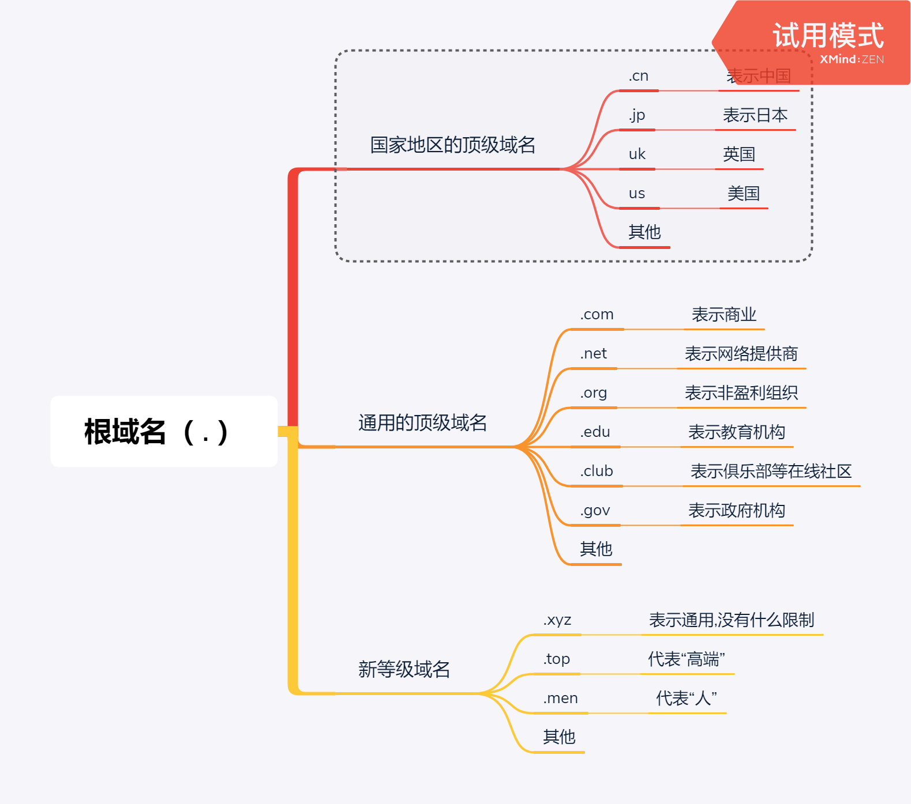
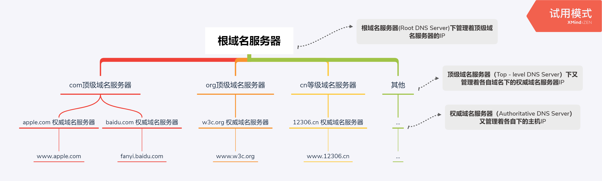
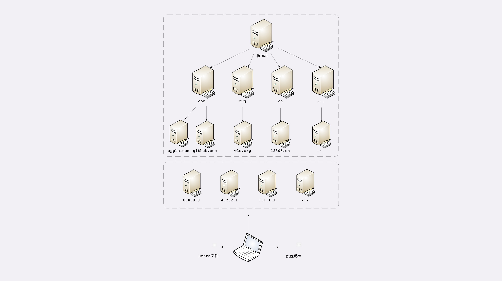

# DNS（域名系统）

> #### 什么是 DNS ？

所谓的 DNS 其实是 Domain Name System 的缩写，翻译过来就是 “域名系统”，那么为什么会有这个所谓的 “域名系统” 呢 ？这就得从 TCP/IP协议说起了，在TCP/IP协议中使用 IP 地址来标识计算机，IP地址其实就是一串用4个点来分隔的数字，这种数字形式的地址对于计算机来说是很方便识别，但是对于人类来说既难以记忆有难以输入，于是“域名系统”就出现了，人类用有意义的名字来作为IP地址的等价代替，就好像人的名字与身份证号码一样。但是域名与IP地址的映射关系要如何管理呢？这就是“域名系统”存在的意义

> #### 域名的组成

域名 是用 “.” 分隔的多个单词，域名的总长度限制在253个字符以内，每级域名长度不超过63个字符，域名的级别从左到右依次升高

1、**根域名** ：根域名一般用 “.” 标识 ，例如（www.example.com.），但是最后的 “.”通常是**省略**的，在平常的域名中很少见。

2、**顶级域名** ： 根域名下是 “顶级域名”，如：com、net、cn 等，

3、**二级域名** ：顶级域名下是 “二级域名”，如：baidu.com 中的 baidu

4、**子域名**：二级域名下就是子域名，也就是主机名，通常用来表明主机的用途，如：www.baidu.com 中的 www , “www” 表示提供万维网服务，“mail” 表示提供邮件服务，fanyi.baidu.com 中的 fanyi 表示语言翻译等，不过这些都不是绝对的，名字主要是为了方便记忆

常用的顶级域名如下：

> #### 域名解析

就像IP地址必须要转换成MAC地址才能访问主机一样，TCP/TP协议使用IP地址用来进行通信，那么就必须把域名 “映射” 成一个互联网的真实的 IP 地址，这就是所谓的 “**域名解析**”

由于每天互联网上的访问都是天文数字，这些请求绝大部分都是通过域名来访问的，那么域名系统（DNS）就成了互联网上的重要基础设施，必须要保证域名的解析是高效稳定可靠的

DNS 的 核心系统是一个三层的树状、分布式服务，基本对应如下域名结构：

**那么根据上面的结构，如果访问：www.apple.com 服务，那么就要进行如下3个步骤：**

1、第一步：访问根域名服务器，它会告诉你 “com” 顶级域名服务器IP地址

2、第二步：访问 “com” 顶级域名服务器，它会告诉你 “apple.com” 服务器IP地址

3、第三步：访问 apple.com 域名服务器，就可以得到 “www.apple.com” 服务器IP地址

虽然核心的 DNS 系统遍布全球，服务能力也很强，但是如果全世界的网民访问互联网都也经历这样的步骤，那这样也未免太牵强，就算是核心的 DNS 服务器不挂掉，性能上也很难得到保证。那么这个时候代理DNS服务器、缓存等手段就出现了，很多大公司，网络运营商都会建立自己的DNS服务器。

比如下面这几个比较知名的DNS服务器：

1、Google：8.8.8.8

2、Microsoft：4.2.2.1

3、CloudFlare：1.1.1.1

这些野生的DNS服务器其实要比核心的DNS服务器多的多，他们缓存了之前访问的域名映射结果，如果下次再访问的时候，他们就可以直接返回结果，这样就避免了向根服务器发起请求，缓解了核心DNS服务器压力，提高了查询速度

其次，操作系统里面会存在DNS查询记录缓存、主机映射文件（hosts文件），如果在缓存里面找不到相关的DNS记录，就会去找hosts文件，没有找到则会往DNS服务器上查找，一般情况下本地网卡都有一个分配的 DNS Server IP, 这个IP一般是非官方的DNS服务IP，比如 Google 的 “8.8.8.8”

**完整的DNS架构图：**

> #### 具体实例说明

比如我要上线我的博客网站：www.greenlotuses.com

1、首先要到域名注册商那里申请域名：greenlotuses.com，域名解析的时候把 **域名A记录** 保存到这个域名注册商的DNS服务器上，该DNS服务器为权威域名服务器

2、当浏览器访问greenlotuses.com的时候，首先会查找浏览器的DNS缓存记录

3、浏览器没有DNS缓存记录，那就查找系统系统的DNS缓存记录

4、操作系统上没有DNS缓存记录，那就查找host文件上的域名映射记录

5、host文件上没有域名映射记录，那就查找域名服务器（本地网卡上分配的 DNS Server IP，也自己可以设置，野生的DNS服务器上，如何：Google 的 “8.8.8.8”）

6、如果没有则 根域名服务器、顶级域名服务器、二级域名服务器、权威域名服务器 等依次查找

**总体的查找流程如下：**

浏览器DNS缓存 **—>** 操作系统DNS缓存 **—>** hosts文件 **—>** 非权威域名服务器 **—>** 根域名服务器 **—>** 顶级域名服务器 **—>** 二级域名服务器 **—>** 权威域名服务器。

其中非权威域名服务器还包括LDNS（企业内网DNS服务器），三大营运商DNS，谷歌公开的DNS，微软公开的DNS等。

