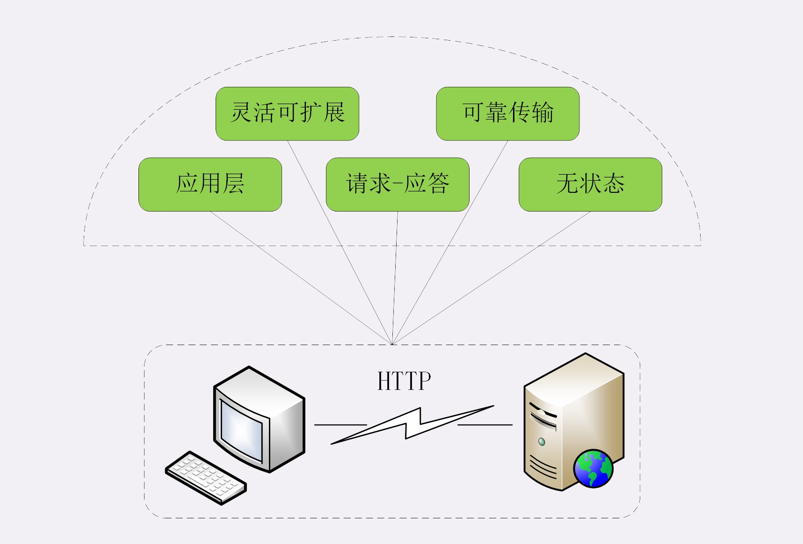

# HTTP的特点

> #### HTTP协议有哪些特点 ？

1、**灵活可扩张**

**HTTP 协议是一个 “灵活可扩展” 的传输协议**，它只规定了报文的基本格式，比如：空格分隔单词、换行符分隔字段、header + body 模式等，报文没有严格语法语义限制，开发者可以根据需求任意定制，body 也不在限制于文本形式的TXT、HTML，可以是 图片、音频、视频等任意数据，这些都是得益于它的 “灵活可扩张” 性

2、**可靠传输**

**HTTP 协议是一个 “可靠” 的传输协议** , 它是基于TCP/IP的，而TCP本事就是一个 “可靠” 的传输协议，所以HTTP协议自然就继承了这一特点，但是 “可靠” 并不是 100% 保证数据能够发送成功， 因为这取决于当下的网络环境、传输介质等，比如：网络忙、连接质量差、光纤网线不通等条件下可能没法传输成功

3、**请求 / 应答 模式**

**HTTP 协议使用的 “请求 / 应答” 的通信模式** ，通俗来讲就是 “一发一收，有来有回”，客户端主动发送请求，服务器响应请求，当然服务器也可以充当代理的角色，可以同时扮演请求/应答方，“请求 / 应答”模式也完全符合RPC（Remote Procedure Call）的工作模式，可以把Http请求封装成远程函数调用，导致了 WebService 、RESTful、gRPC等的出现

4、**无状态**

**HTTP协议是一个 “无状态” 的传输协议**，所谓的 “无状态” 其实就是客户端与服务端无法保存它们之间通信的记录，比如：连接状态、历史通信状态、用户数据、标识等，因为 HTTP 是建立在 TCP/IP 上的协议，TCP/IP是有状态的，但是这些状态对与HTTP来说是透明的，因为这些状态是在TCP/IP里面维护的，HTTP协议规范里面没有规定任何有关 “状态” 的规定 ，客户端与服务器端永远处于一种 “无知，没有记忆能力” 的状态中，每次连接一断开，下次又不知道你是谁了

TCP协议的状态：

1、起初是 CLOSED 状态 

2、连接成功后是 ESTABLISHED  状态 

3、断开连接后是：FIN-WAIT 状态

4、最后是 CLOSED 状态

5、**应用层协议**

**HTTP协议是一个 “应用层” 的传输协议**，建立在在TCP/IP之上，它几乎无所不能，正因为如此所以从出道到现在几乎统治了整个互联网，称的上是 “万能” 协议，当然这其中也不乏其他的应用层协议，例如：FTP协议（只能传输文件）、SMTP协议（只能发送邮件），SSH协议（只能远程登录）等，但是这些协议与HTTP协议来比职责都太单一

> #### HTTP/1.1 协议的优缺点？

1、**HTTP最大的有点是就是简单、灵活、易扩展**

HTTP 协议是灵活的，基本的报文格式就是header与body，报文里面核心组成要素：请求方法、URI、状态码、原因短语、头字段等都没有被 “写死”，开发者可以根据自己的需求自行进行定制，充分的体现了它的灵活性，正因为它的灵活性使得它具备无限的可扩展性

2、**HTTP拥有成熟的软件硬件环境，应用的非常广泛，是互联网的基础设施**

随着移动互联网的普及，HTTP 在当今设备无处不在，不管是应用领域 还是 开发领域 HTTP都得到了广泛的应用与支持，同时也为创业者提供了无限可能

3、**HTTP 是 “无状态” 的，可以轻松的实现集群化、扩展性能，但同时也因为这个特点需求Cookie技术来实现 “有状态”**

HTTP 这个 “无状态” 的特点，是一把双刃剑，因为它没有 “记忆能力” 所以不额外的资源来记录状态信息，所以不管从空间上还是实现上都会简单一些，正因为没有状态，所以每台服务器没有 “状态” 差异，可以很好的实现集群，让负载均衡把请求转发的任意一台服务器。但正因为它的 “无状态” 导致了它无法支持需要连续的多个步骤的 “事物” 操作，所以有了 cookie 出现，需要依赖cookie来解决这些问题

4、**HTTP 是文明传输，数据完全肉眼可见，能够方便的研究分析，但同时也容易被窃听**

HTTP 这个 “明文” 传输也是一把双刃剑，因为这样所以可开发者可以很方便的进行抓包试调，当然也正是因为这样会把传输的信息暴露出来，毫无隐私可言

5、**HTTP 是不安全的，无法验证通信双方的身份，也不能判断报文是否被篡改**

HTTP是不安全的，它与明文传输有一定关系但是不完全等同，明文只是 “机密” 的一个缺点，但是 HTTP本身无法做到 **身份认证**、**信息完整性校验**

**身份认证**：现实生活中 我可以那自己的身份证证明 “自己是自己”，但是在虚拟网络世界HTTP没有提供有效的手段来确认通信双方的真实身份，虽然协议里面提供了一个基本的认证机制，但是因为明文传输的特点，这个机制几乎没有什么用

**信息完整性校验**：数据的传输过程中很容易被篡改，而HTTP中无法验证传输的数据是否被篡改过，所以才有了 HTTPS 的出现

6、**HTTP的性能不算差，但不完全适应现在的互联网，还有很大的提是空间**

HTTP的性能方面算是中规中矩，但是TCP的性能是不错的否在也不会在互联网上立足这么久，但是HTTP使用的 “请求/应答” 模式上，当请求序列中的一个请求被阻塞，后面的请求就必须的排队等待，这就是著名的 “队头阻塞” ，所以这块还有很大的提升空间，不过好在 http2、http3 针对这个问题已经有了解决方案

