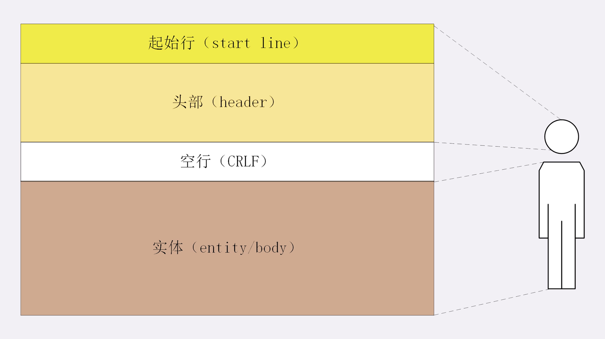
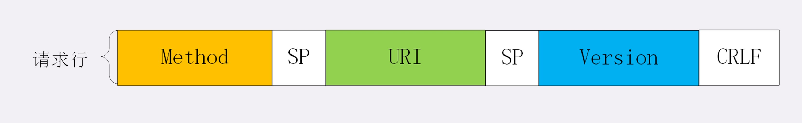
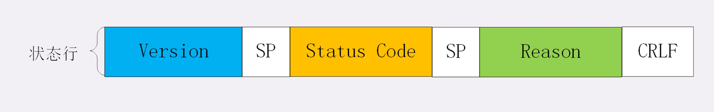
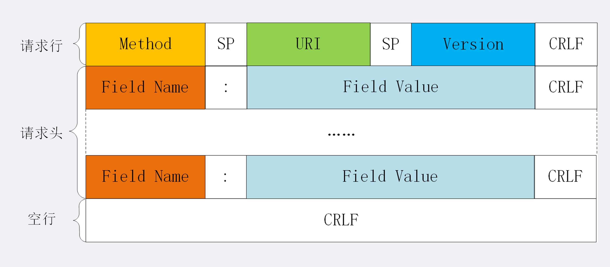
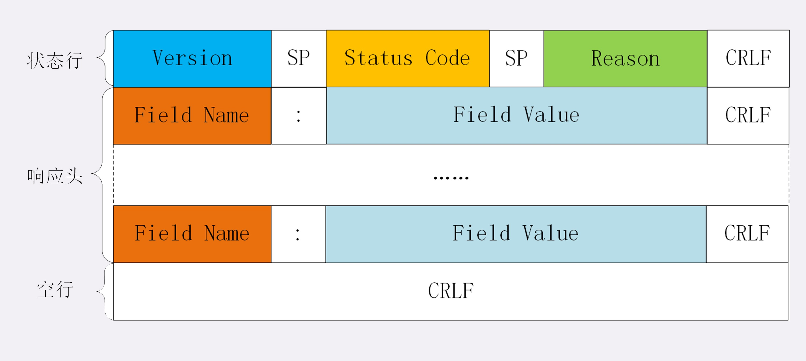
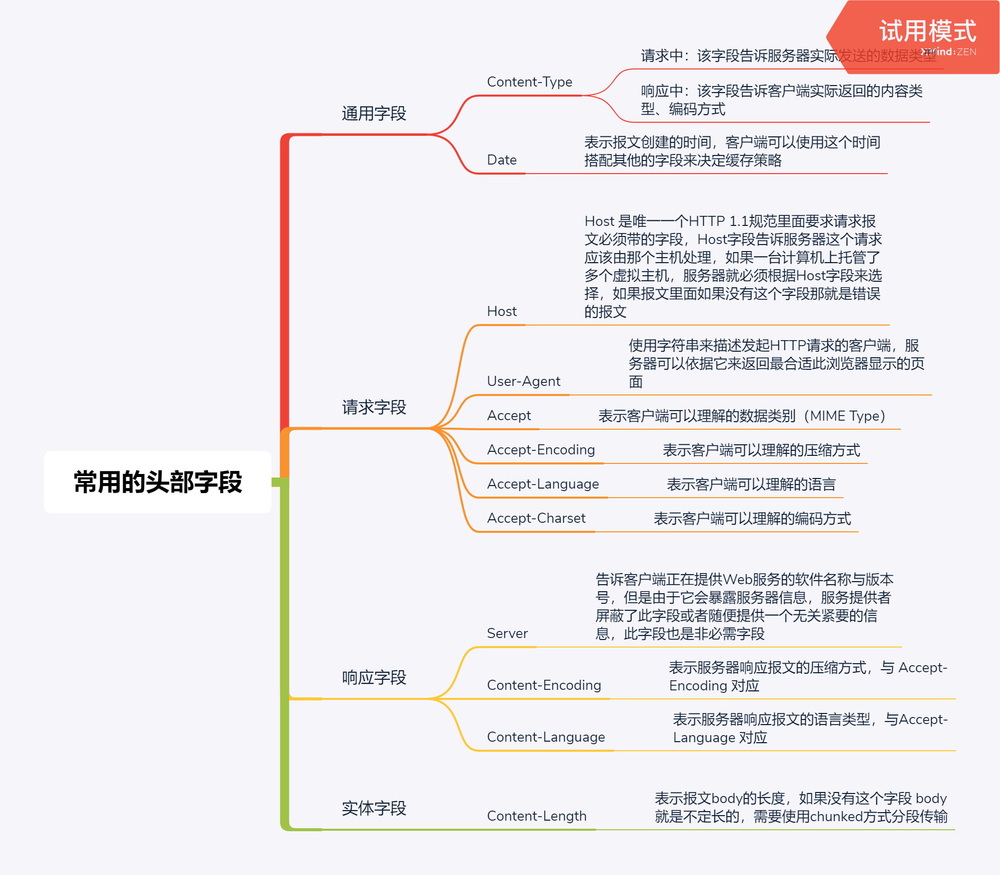

# HTTP报文

通过上面的几个章节的介绍其实对HTTP协议已经基本了解了HTTP的工作模式，由于TCP/TP协议负责底层的传输工作，HTTP协议基本就不用在传输这方面下功夫，这个所谓的 “超文本传输协议” 是不是有点名不副实，那么这个HTTP协议的核心部分到底是什么呢 ？

答案就是它的 **传输报文**

HTTP协议规范严格的定义了传输报文的格式，规定了报文的 **组成部分**、**解析规则**、**处理策略**等，正因为有了这些规范，所以可以在TCP/IP层之上实现 **连接控制**、**缓存管理**、**数据编码**、**内容协商** 等 灵活丰富的功能

> #### HTTP协议的报文组成结构

HTTP协议请求/响应报文的组成结构基本相同，具体的由3的部分组成：

1、**起始行（start line）**: 描述请求或响应的基本信息，如：**请求方法**、**请求的URL**、**HTTP版本**、**响应状态码**、**响应状态信息**

2、**头部字段集合（header）**: 使用 key-value 的形式更加详细的描述报文信息

3、**消息正文（entity or body）**: 实际传输的数据，不一定是纯文本，可以是：图片、视频等二进制数据

其中 **起始行** 与 **头部字段** 又合并称为 **请求头** 或 **响应头** ， 消息正文 又称为 **实体** 或 **body**

HTTP 协议规定**传输报文**必须要有 **header**，可以没有 **body** , 并且 header 之后必须要有 **空行** 与 body 隔开

如图：



现实的 请求报文 与 响应报文：


> #### 报文起始行（start line）

报文起始行分： 请求行、状态行

**请求行** 就是请求报文的起始行，由3部分构成：

1、**请求方法**：HTTP的动作，如：GET、POST、PUT，表示对资源的操作

2、**请求的目标资源**：通常是一个 URI, 标记了请求动作要操作的资源

3、**HTTP版本号**：表示报文使用的HTTP版本号

这三部分通常使用空格（space）来分隔，最后要用 CRLF 换行表示结束



现实的请求行：

```text
POST https://blackhole.m.jd.com/getinfo HTTP/1.1
```

状态行 就是响应报文的起始行，同样也是由3部分构成：

1、**HTTP版本号**：表示报文使用的HTTP版本号

2、**状态码**：3位数字，表示服务器处理的结果

3、**原因**：作为数字状态码的补充描述，处理结果的解释文字，帮忙人类理解

这三部分通常使用空格（space）来分隔，最后要用 CRLF 换行表示结束



现实的状态行：

```text
HTTP/1.1 200 OK

HTTP/1.1 404 Not Found
```

> #### 头部字段

头部字段是用 key-value 的形式来表现的，key 和 value 之间用 “**:**”分隔，且 “**key**” 与 “**:**” 之间不能有空格，最后用 CRLF 换行表示字段结束




HTTP头字段非常灵活，它不仅可以有标准的已有头，如：host、connection 等，也可以支持自定义头，这样决定了HTTP协议的可扩展性，不过没有规矩就不成方圆

**自定义头字段时应注意如下细节：**

1、头字段名不区分大小写，当首字母大小可读性更强，如：Host: www.greenlotuses.com

2、头字段名称不允许有空格，可以使用“-”连接单词，但不能使用下划线“_”，如：可以是 Field-Name:123 , 但不能是 Field Name:123 或 Field_Name:123

3、“**key**”后面必须紧跟着“**:**”，不能有空格，但是“**:**” 后面可以跟着空格， 如：FieldName:   123

4、头字段的顺序不影响语义

5、头字段原则上是不允许重复，除非字段本身语义允许，例如：Set-Cookie 字段就允许重复

> #### HTTP协议的实体数据（Body）

HTTP协议是应用层的协议，构建在TCP/IP之上，TCP/IP关注的是传输，它并不关心body的数据结构内容等，所以这份责任就落到了 HTTP 头上，毕竟没有规矩就不成方圆。HTTP协议是请求/应答的模式，浏览器发出一个请求，服务器就要响应这个请求，那么在这 “一问一答” 的通信过程中必定会涉及到通信的内容的 “语言”、“格式类型”，“编码方式” 等问题，否则浏览器要怎么解析服务器响应的数据呢 ？很显然这是一个双方 **协商** 的过程，浏览器必须要把他期望的内容的 “语言”、“格式类型”，“编码方式” 等信息告诉服务器进行 **协商**，然后服务器尽量根据浏览器的要求返回浏览器期望的数据内容形式，由于HTTP著名的 “header + body” 格式的报文，**协商** 的具体要求只能通过 header 来完成

1、**HTTP规定了使用 “Accept” 头字段，表示客户端可以理解的 MIME Type ，服务器会用 “Content-Type” 头字段来表示返回内容使用的MIME Type** 

```text
请求：
Accept: text/html,application/xml,image/webp,image/png

响应：
Content-Type: text/html
```

**温馨提示**：HTTP协议的 “Content-Type” 头字段在 “请求头”、“响应头” 上都有出现，在 “请求头” 表示以什么样的格式发送报文给服务器，通常在 "POST" 请求里面这个头字段是必须要有的，“GET” 请求在请求体为空的情况可以没有这个头字段，Axios库就是这样干的

2、**HTTP规定了使用 “Accept-Charset” 头字段，表示客户端可以理解的编码方式 ，服务器会用 “Content-Type” 头字段添加 “charset=xxx” 来表示返回内容使用的编码方式** 


```text
请求：
Accept-Charset: gbk, uft-8

响应：
Content-Type: text/html; charset=utf-8
```

3、**HTTP规定了使用 “Accept-Encoding” 头字段，表示客户端可以理解的压缩方式 ，服务器会用 “Content-Encoding” 头字段来表示返回内容使用的压缩方式** 

```text
请求：
Accept-Encoding: gzip, deflate, br

响应：
Content-Encoding: gzip
```

4、**HTTP规定了使用 “Accept-Language” 头字段，表示客户端可以理解的语言 ，服务器会用 “Content-Language” 头字段来表示返回内容使用的语言** 

```text
请求：
Accept-Language: zh-CN, zh, en

响应：
Content-Language: zh-CN
```

5、内容协商的权重值

在 HTTP 协议里面用 Accept、Accept-Encoding、Accept-Language 等头部字段进行内容协商的时候，可以使用特殊的“q”参数表示权重来设定优先级，
q 是 “quality factor” 的意思，具体的形式是数据类型或语言代码后面添加 “;”，然后是 “q=value” , value 的最大值是 1（默认值），最小值是 0.01 ， 0 表示拒绝

```text
Accept: text/html,application/json;q=0.9,*/*;q=0.8
```

5、内容协商的结果

内容协商的过程是根据服务器而定的，因为每个服务器的算法可能都不一样，通常服务器会在响应头里面加个 “Vary” 字段，记录服务器在内容协商是参与的请求头字段，给出一点信息：

```text
Vary: Accept-Encoding,User-Agent,Accept
```

表示服务器根据 “Accept-Encoding,User-Agent,Accept” 这个几个字段决定发回什么样的响应报文


**HTTP 里经常遇到的几个类别（MIME type）：**

1、**text**：即文本格式的可读数据，我们最熟悉的应该就是 text/html 了，表示超文本文档，此外还有纯文本 text/plain、样式表 text/css 等。

2、**image**：即图像文件，有 image/gif、image/jpeg、image/png 等

2、**audio/video**：音频和视频数据，例如 audio/mpeg、video/mp4 等

3、**application**：数据格式不固定，可能是文本也可能是二进制，必须由上层应用程序来解释。常见的有 application/json，application/javascript、application/pdf 等

4、如果实在是不知道数据是什么类型，像刚才说的“黑盒”，就会是 application/octet-stream，即不透明的二进制数据

仅有 MIME type 还不够，因为 HTTP 在传输时为了节约带宽，有时候还会压缩数据，为了不要让浏览器继续 “猜”，还需要有一个“Encoding type”，告诉数据是用的什么编码格式，这样对方才能正确解压缩，还原出原始的数据。比起 MIME type 来说，Encoding type 就少了很多，常用的只有下面三种：

1、**gzip**：GNU zip 压缩格式，也是互联网上最流行的压缩格式；

2、**deflate**：zlib（deflate）压缩格式，流行程度仅次于 gzip；

3、**br**：一种专门为 HTTP 优化的新压缩算法（Brotli）。数据类型使用的头字段


> #### 常用的头字段

HTTP协议规定了非常多的头部字段，以实现各种各样的功能，但基本上可以分为4大类：

1、**通用字段**：在请求头、响应头里面都可以出现

2、**请求字段**：仅在请求头里面出现的字段，通常用来说明请求独有的附加信息

3、**响应字段**：仅在响应头里面出现的字段，通常用来说明响应独有的附加信息

4、**实体字段**：实际是通用字段，专门用来说明body的额外信息


