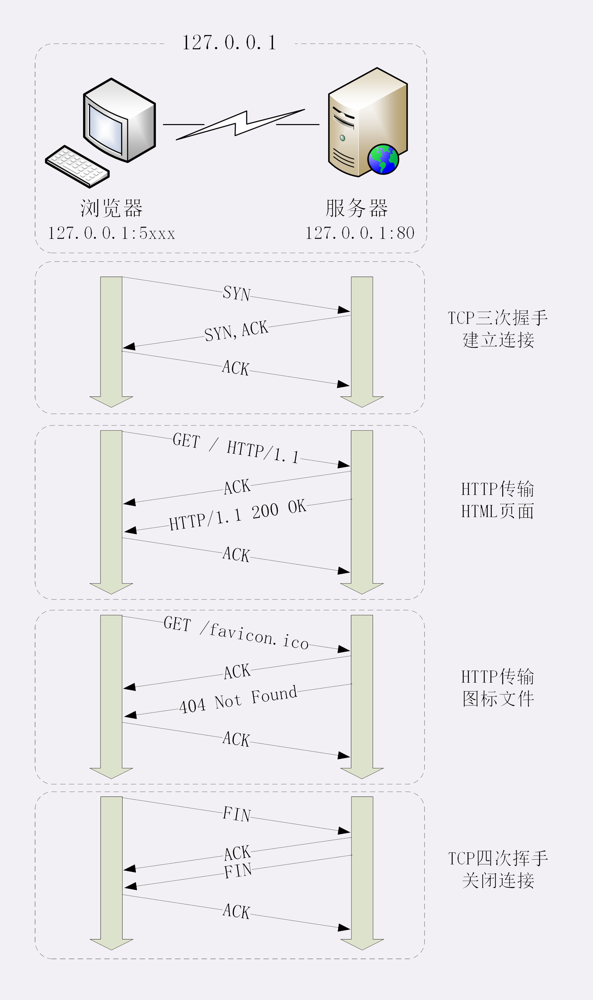

# http请求过程

> #### 浏览器地址栏输入网址按下回车后发生了什么？

这是在面试过程中经常被问到的问题，这里我先回答这个问题：

**1、首先 浏览器将网址的域名转换成对应的IP地址**

**2、然后 通过TCP的3次握手与服务器建立链接**

**3、接着 浏览器用拼好的报文向服务器发送请求**

**4、再接着 服务器收到报文后处理请求，然后将处理结果拼成报文发送给浏览器**

**5、最后 浏览器解析报文，渲染输出页面**

> #### 浏览器如何将网址的域名转换成对应的IP地址 ？

首先要解释这个问题，我觉得要分两步：

 **第一步：浏览器为什么要将域名转换成IP地址 ？**

HTTP协议是属于应用层的协议，它是建立在TCP/TP协议的基础之上的，而TCP/TP协议是使用IP地址用来进行通信，所以要把域名转换成IP地址

**第二步：浏览器如何将域名转换成IP地址，具体转换过程是怎样的？**

1、浏览器拿到域名之后，就会查找浏览器的DNS缓存里是否存在相关的记录

2、浏览器的DNS缓存没有相关记录，就会去操作系统的DNS缓存里查找是否存在相关的记录

3、操作系统的DNS缓存没有相关记录，就会去 hosts 文件上查找是否存在相关的记录

4、 hosts 文件上没有相关记录，就会去系统上默认的DNS服务器上查找（一般是非权威DNS服务器）

5、非权威DNS服务器没有相关记录，就会去根域名服务器上查找

6、接着到 顶级域名服务器、二级域名服务器、权威域名服务器 依次查找，直到返回相应的服务器IP地址，否则就无法访问

> #### 浏览器与服务器的连接过程是怎么的 ？

我们都知道HTTP协议是运行在TCP/IP协议基础上，依靠TCP/IP协议来实现数据的可靠传输，所以浏览器要用HTTP协议收发数据，首先要做的就是与WEB服务器建立TCP链接，建立连接后的具体处理过程如下：

1、要建立TCP链接，就必须要经过 “3次握手”（这3次握手是在TCP协议层发生的，对于HTTP协议层来说是透明）

2、连接建立之后，浏览器按照HTTP协议规定的格式拼装好报文，通过TCP发送一个报文请求

3、服务器接收到请求的报文后会立马做一件事：给TCP协议层回复一个接到报文的包（对于http来说是透明的）

4、接着要解析接收的报文，明白报文要做什么事情，处理好之后，按照HTTP协议规定的格式拼装好报文回复给浏览器

5、浏览器接收到返回的报文后，TCP协议层首先会给服务器回复一个接收到报文的包（对于http来说是透明的），

6、浏览器拿到报文，解析报文，渲染输出页面

7、4次挥手关闭连接，由于限制浏览器支持长连接，在有效期内并不会关闭连接

**如图：Wireshark工具的捕获的数据包**

**注意：SYN、ACK、FIN 都是在 TCP协议层 与 服务器层 发生，对于 HTTP 层是透明的**

