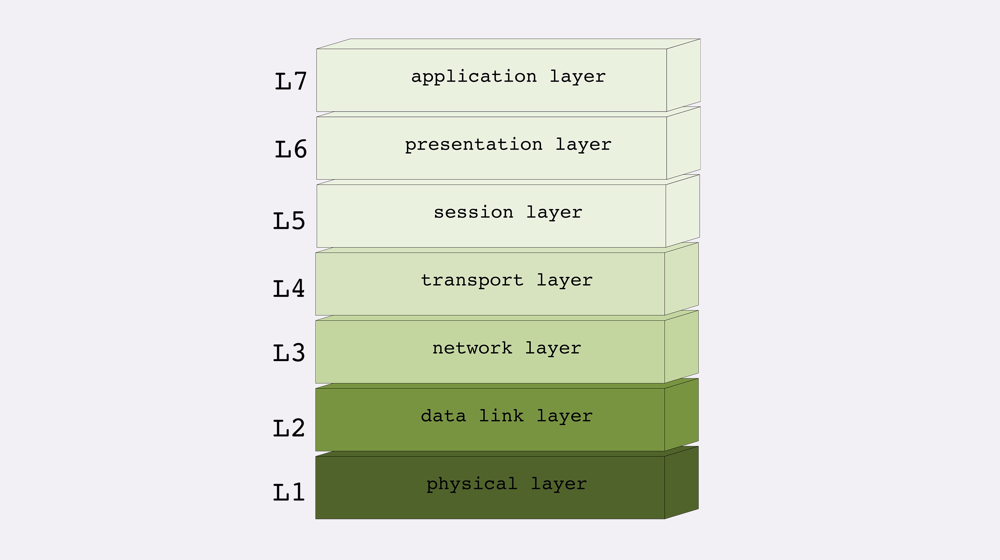
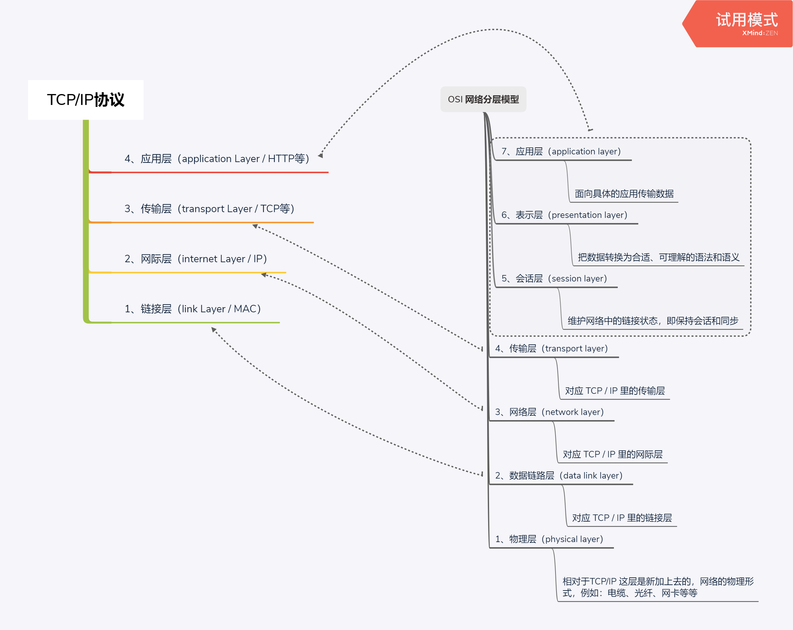
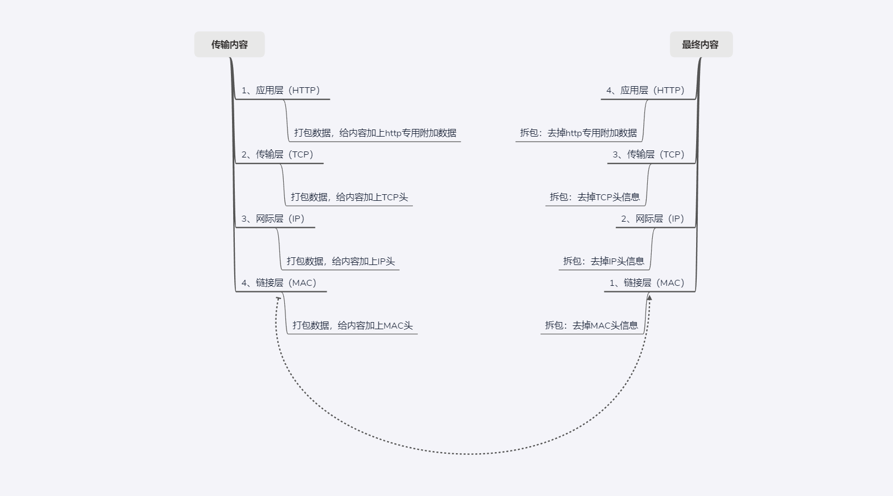

# TCP/IP 协议

> #### TCP/IP 协议

TCP/IP 协议是目前网络世界标准的通信协议，实际上它是一系列通信协议的统称，其中最核心的是 TCP协议 和 IP协议，其他的还有 UDP、ICMP、ARP等等其他协议。

IP 是 Internet Protocol 的缩写, 主要的目的是解决寻址和路由问题，以及如何在两点间传送数据包，IP协议使用IP地址来标识定位互联网上的每台计算机

TCP 是 Transmission Control Protocol 的缩写，意思就是 “传输控制协议”，它位于IP协议之上，基于IP协议提供可靠的、字节流形式的通信，是HTTP协议实现的基础

TCP/IP 协议总共分成了 4 层 分别是：链接层、网际层、传输层、应用层 , 如下图：

> #### 第一层：链接层

链接层是负责在以太网、wifi这样的底层网络上发送数据包，工作在网卡这个层次，是用MAC地址标识网络上的设备，所以有时也叫MAC层

> #### 第二层：网际层

IP协议就处在这一层，因为IP协议定义了IP地址，所以在链接层的基础上用IP地址取代MAC地址，把许多的局域网、广域网链接成一个虚拟的巨大网络，在这个网络上只要把IP地址在翻译成MAC地址就可以了

> #### 第三层：传输层

传输层是TCP协议工作的层次，TCP是一个有状态的协议，需要先与对方建立链接然后才能发送数据，且保证数据不丢失不重复，TCP协议的职责就是保证数据在IP地址标记的两点之间可靠的传输。当然出了TCP以外还有就是UDP协议也处于这一层次，相对于TCP而言UDP最大的不同是它是无状态的，不需要事先建立连接就可以任意发送数据，也就因为这样一个特点所以它无法保证传输的数据对方一定能接收到，由于它事先不需要建立连接，从而决定了传输性能比TCP更加优越。除了这个以外，还有就是TCP传输的数据是的连续字节流，可以有序的接收，而UDP则是一些分散的数据包，可以有序的发送，但是不能保证有序接收

> #### 第四层：应用层

应用层的话主要是依赖前面三层的基础，它可以是各种具体应用的协议，例如：除了HTTP协议以外还有 Telnet、SSH、FTP、SMTP等等协议

> #### OSI网络分层模型

 OSI 全称是 “开放式系统互联通信参考模型（Open stystem Interconnection Reference Model）” , TCP/IP 发明于1970年代，当时除了TCP/IP协议还有很多其他的协议，整个网络世界比较混乱，国际标准组织（OSI）为了有个统一的标准设计出了这个网络分层模型，用这框架模型了统一各种网络协议。OSI网络分层模型分了7层，从下到上分别是：

 

 第一层：**物理层**，网络的物理形式，例如：电缆、光纤、网卡、集线器等等，TCP/IP 是一个纯软件的栈，没有这一层，相对于没有最根基的网络物理形式，而OSI补足了这一点

 第二层：**数据链路层**，对应 TCP/IP 的 **链接层**

 第三层：**网络层**，对应 TCP/IP 的 **网际层**

 第四层：**传输层**，对应 TCP/IP 的 **传输层**

 第五层：**会话层**，维护网络中的链接状态，既保持会话和同步

 第六层：**表示层**，把数据转换为合适、可理解的语法和语义

 第七层：**应用层**，面向具体的传输协议，例如：http、telnet、ftp、ssh等

> #### TCP/IP分层 与 OSI网络分层 的对应关系

 

 > #### TCP/IP协议栈的工作方式

 对应TCP/IP协议栈的工作方式的理解，其实可以把它想象成 发、收 快递的一个过程

 例如：你要寄一个游戏机给你的朋友：

 1、**首先** 你自己肯定会直接打包一层（http打包，附加上相关信息）

 2、**然后** 快递员给你打包一层（TCP打包，附加上相关信息）放入三轮车运输到集散点

 3、**接着** 由于路途比较长为了安全，集散点再打包一层（IP打包，附加上相关信息）

 4、**最后** 装入运输车辆（mac打包，附加上相关信息）
 
 到了目的地之后
 
 1、从运输车里面取出货物（拆包：MAC层）放到集散点，然后快递员送给你朋友，接着你朋友会做如下动作：

 2、拆包集散点封装的这一层（IP层）

 3、拆包快递员封装的这一层（TCP层）

 4、拆包你自己封装的这一层（HTTP层）

 最后拿到游戏机。
 
 **对于整个打包拆包的过程，应用层以下的层级都是操作系统处理的，下层的处理方式对于上层来说也是透明的，上层只要按照规范打包数据传给下层就好**
 
 具体的打包拆包流程图如下：

  

  注意：
  
  MAC地址（Media Access Control Address）也就是所谓的局域网地址，可以唯一标识一个网卡，也就同时标识了此网卡所属的设备

  HTTP的传输但是消息或报文（message）

  TCP层传输的单位是段（segment）

  IP层传输的单位是包（packet）

  MAC层传输的单位是帧（frame）

  以上统称为数据包

 
 
