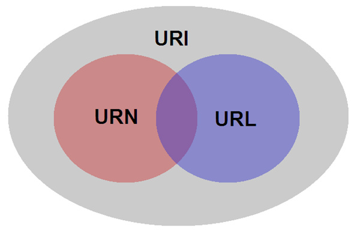
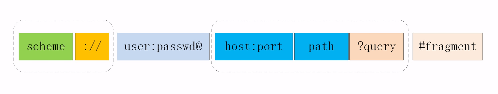
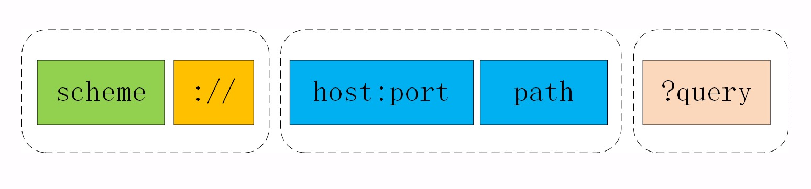

# URI（统一资源标识符）

> #### 什么是 URI ?

URI 是 Uniform Resource Identifier 的缩写 ，用来标识互联网上的资源，具有唯一性，当然标识的方式可能有很多种，称作 “**统一资源标识符**”

> #### 什么是 URL ?

URL 是 Uniform Resource Locator 的缩写 ，用来定位互联网上的资源，同时具备了 唯一、可定位的性质 ， 称作 “**统一资源定位符**”

> #### 什么是 URN ?

URL 是 Uniform Resource Name 的缩写 ，表示互联网资源的名称 ，称作 “**统一资源命名**”

> #### URI 、 URL、URN 三者之间的关系 ?

举个例子：**黎平** 同学

**身份号码**：“441021199001254527” 可以唯一标识 **黎平**

**具体地址**：“中国/湖南省/郴州市/桂阳县/飞仙镇/坂田街道/2巷3号/604” 可以唯一标识定位 **黎平**

**资源名称**：“黎平” 资源的命名 ，

这里的 “身份号码”、“具体地址”、“资源名称” 就可以理解成： **标识符（URI）**、**定位符（URL）**、**资源命名（URN）**

身份号码、具体地址 都可以唯一标识 “黎平” 这个人，所以它们都是**标识符（URI）**，而身份号码可以标识但不能定位“黎平”这个人，所以**标识符（URI）** 未必就是 **定位符（URL）** ， 资源名称是 “人” 命名，中国那么大鬼知道他是哪个地方的街道巷子的 **黎平**，但是 “具体地址” + “资源名称” 可以唯一标识定位 **黎平** 这个人

结论：**URL 是 URI 的一种实现或子集 ， URI 未必就是 URL  ，URI 可以是由 URL + URN 构成** 

**温馨提示**：作为互联网的资源具有唯一的标识 或者 资源名称 是不够的，它必须具备可定位（可访问）的性质，所以我们通常认为 URL 就是 URI，但是如果从实际定义上来讲他们还是有一定的区别，只是URL太大众化了而已

> #### URI 的基本结构

**完整结构：**

**常用结构：**

1、“**scheme**”  表示资源应该使用哪种协议来定位或访问

2、“**://**” 用来分隔 scheme 与 authority 部分 ， “://” 之后的部分称作 authority的部分， 通常表示资源所在的主机名（host:port）等

3、“**host:port：**” 表示主机名，一般是 IP地址、域名 ，port一般是省略（通常有默认的：http 是 80 ， https 是 443），

4、“**path：**” 表示资源所在的位置，path 必须以 “ / ” 开始，不要认为 “ / ” 是 authority 的部分

5、“**query：**” 表示对资源附加额外的修饰，比如：获取网络图片，但是我想要一个 30 X 30 的缩略图，这个时候这些参数就可以往 query 里面添加，query 前面有个 "?" 分隔符，但是它并不包含 "?" ，以 key=value 的形式出现，多个KV值用 “&”连接，query参数任何的变化都代表一个全新的定位符

6、“**#fragment：**” 片段表示符，用来定位资源内部的一个 “锚点” 或 “标签”，浏览器可以在获取资源后跳转到它指示的位置，当前也被广泛应用于前端单页应用路由的标识

7、“**user:password@**” 表示登录主机的用户名密码，因为包含敏感信息，存在安全隐患，已经不推荐使用了

> #### URI 的编码

在 URI 里面只能使用 ASCII 码 ，如果要在 URI 里面使用英文以外的汉语、日语 或者在 path、query 里面出现了特殊字符怎么办呢 ？

为了解决这种问题，URI引入了编码机制，把ASCII码以外的字符集 和 特殊字符 转换成了 十六进制字节值，然后在前面加上一个 “%”

