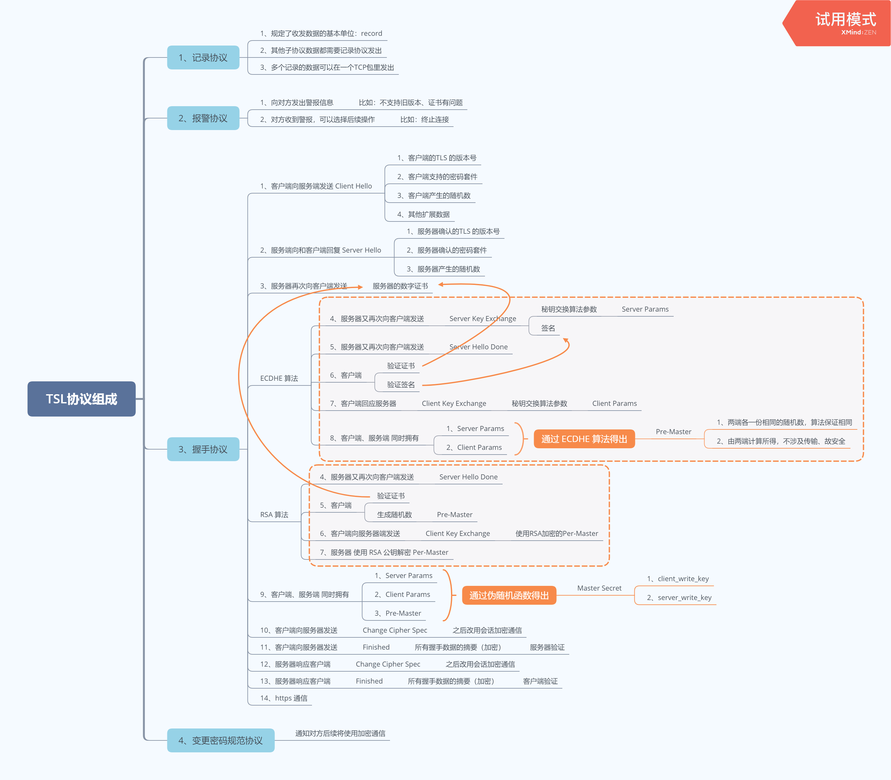
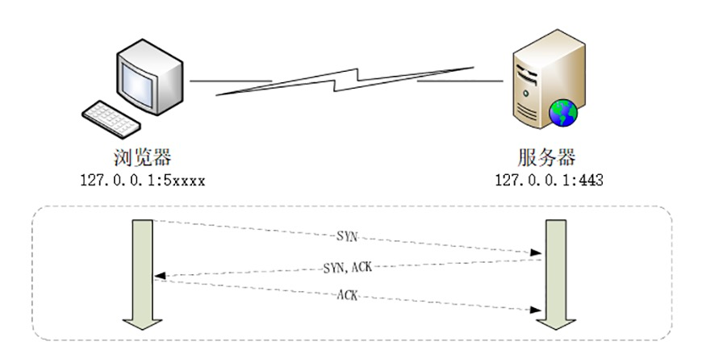
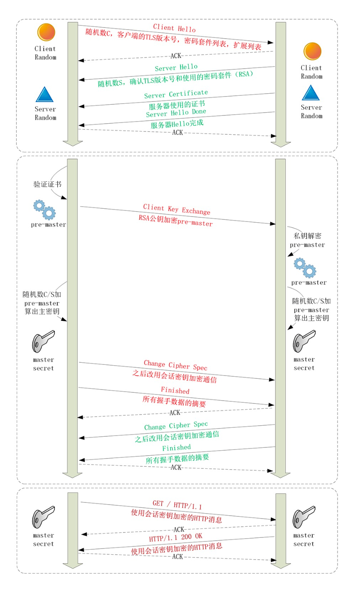

# HTTPS 的连接过程

> #### TSL协议组成

TSL协议由 记录协议、报警协议、握手协议、变更密码协议组成



> #### HTTPS 建立连接

当你在浏览器地址栏输入 “https” 开头的URI，在按下回车，会发生什么呢 ？

1、浏览器首先从URI里面提取 “协议名”、“域名”，由于协议名是“https”，所以浏览器知道了端口默认是 443

2、浏览器在用DNS解析域名得到IP地址（这个过程看http连接讲解）

3、建立TCP连接（TCP连接建立之后，如果在HTTP上是可以直接通信了）

4、TCP连接建立之后会有TSL协议的 “握手” 过程，此过程就是 “HTTPS” 最关键、核心的的部分

5、“握手” 完毕之后才真正建立 “HTTPS” 通信

> #### RSA “握手” 过程

1、首先建立 “TCP连接” 

2、浏览器给服务器发送 “Client Hello”，包括：“TSL的版本号”、“支持的密码套件”、“随机数（Client Random）”、“其他扩展参数” 等

3、服务器给浏览器回复 “Server Hello”，包括：确认支持的 “TSL的版本号”、“密码套件”、“随机数（Server Random）” 参数等

4、服务器给浏览器发送 “数字证书”

5、服务器给浏览器发送 “Server Hello Done”

6、浏览器验证 “数字证书”

7、浏览器生成 “Pre-Master” 随机数，并且使用 RSA 公钥加密 “Pre-Master”，然后带上加密的“Pre-Master”，发出 “Client Key Exchange” 到服务器

8、服务器利用 RSA 私钥解密 “Pre-Master”，至此浏览器、服务器各自拥有 “Client Random”、“Server Random”、“Pre-Master” 3个随机数

9、浏览器、服务器把上面3个随机数作为参数，利用伪随机函数 PRF（基于密码套件最后一个参数，就是摘要算法）生成 “Master-Secret”，但“Master-Secret” 不是最终通信的会话秘钥，而是利用它派生出最终通信的会话秘钥

10、浏览器给服务器发送 “Change Cipher Spec”，表示以后改用会话秘钥加密通信

11、浏览器给服务器发送 “Finished” , 其中把之前所有的握手数据的做了摘要一并传给了服务器

12、服务器验证 “摘要”，然后给浏览器发出 “Change Cipher Spec”，表示确认以后改用会话秘钥加密通信

13、服务器给浏览器发送 “Finished”， 其中把之前所有的握手数据的做了摘要一并传给了浏览器

14、浏览器验证 “摘要”，结束握手过程




> #### ECDHE “握手” 过程

1、首先建立 “TCP连接” 

2、浏览器给服务器发送 “Client Hello”，包括：“TSL的版本号”、“支持的密码套件”、“随机数（Client Random）”、“其他扩展参数” 等

```text
Handshake Protocol: Client Hello    
  Version: TLS 1.2 (0x0303)    
  Random: 1cbf803321fd2623408dfe…    
  Cipher Suites (17 suites)        
    Cipher Suite: TLS_ECDHE_RSA_WITH_AES_128_GCM_SHA256 (0xc02f)        
    Cipher Suite: TLS_ECDHE_RSA_WITH_AES_256_GCM_SHA384 (0xc030)
```

3、服务器给浏览器回复 “Server Hello”，包括：确认支持的 “TSL的版本号”、“密码套件”、“随机数（Server Random）” 参数等

```text
Handshake Protocol: Server Hello    
  Version: TLS 1.2 (0x0303)    
  Random: 0e6320f21bae50842e96…    
  Cipher Suite: TLS_ECDHE_RSA_WITH_AES_256_GCM_SHA384 (0xc030)
```

4、服务器给浏览器发送 “数字证书”

5、服务器给浏览器发送 “Server Key Exchange” 消息，参数 Server Params 包括：椭圆曲线公钥、签名等

```text
Handshake Protocol: Server Key Exchange    
  EC Diffie-Hellman Server Params        
    Curve Type: named_curve (0x03)        
    Named Curve: x25519 (0x001d)        
    Pubkey: 3b39deaf00217894e...        
    Signature Algorithm: rsa_pkcs1_sha512 (0x0601)        
    Signature: 37141adac38ea4...
```
6、服务器给浏览器发送 “Server Hello Done”

7、浏览器验证 “数字证书”

8、浏览器给服务器发送 “Client Key Exchange” 消息，参数 Client Params 包括：椭圆曲线公钥等

```text
Handshake Protocol: Client Key Exchange    
EC Diffie-Hellman Client Params        
  Pubkey: 8c674d0e08dc27b5eaa…
```

9、浏览器、服务器各自拥有了Server Params、Client Params , 然后各自根据这两个参数利用ECDHE算法算出 “Pre-Master”（不涉及到传输，比较安全）

10、浏览器、服务器在根据 Client Random、Server Random、Pre-Master 利用伪随机函数 PRF （基于密码套件最后一个参数，就是摘要算法）各自计算出 “Master-Secret”，但“Master-Secret” 不是最终通信的会话秘钥，而是利用它派生出最终通信的会话秘钥。比如客户端发送用的会话密钥（client_write_key）、服务器发送用的会话密钥（server_write_key）等等

```text
  master_secret = PRF(pre_master_secret, "master secret",ClientHello.random + ServerHello.random)
```

11、浏览器给服务器发送 “Change Cipher Spec”，表示以后改用会话秘钥加密通信

12、浏览器给服务器发送 “Finished” , 其中把之前所有的握手数据的做了摘要一并传给了服务器

13、服务器验证 “摘要”，然后给浏览器发出 “Change Cipher Spec”，表示确认以后改用会话秘钥加密通信

14、服务器给浏览器发送 “Finished”， 其中把之前所有的握手数据的做了摘要一并传给了浏览器

15、浏览器验证 “摘要”，结束握手过程

**注意：如果使用ECDHE算法，握手过程可以在 12 步骤 之后就可以发送 HTTPS 请求，可以不用等 “握手” 完毕，省去了也给消息的往返，这叫 “TLS False Start” 与 TCP 的 “TCP Fast Open” 有点像, 意思就是 “抢跑”，有利于提高效率**


