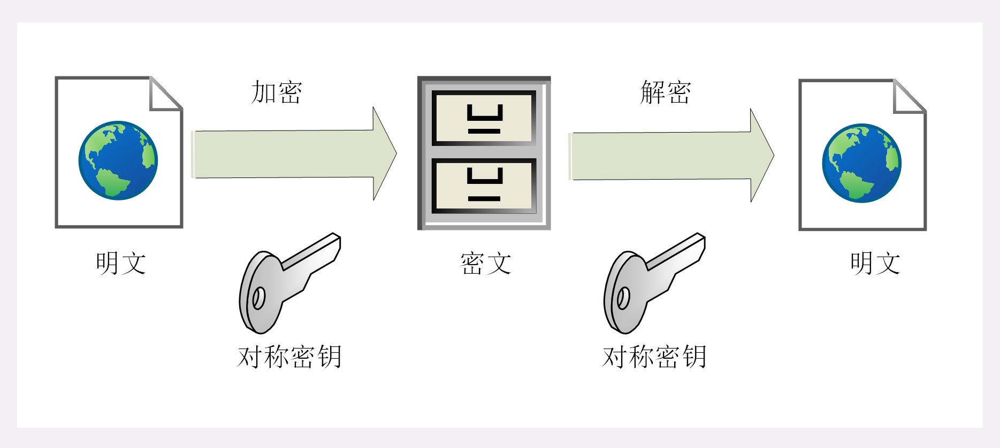
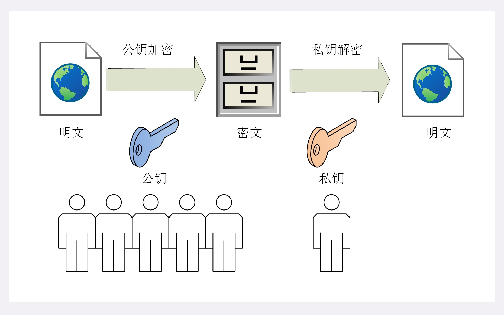

# HTTPS 加密算法

简介篇已经介绍，HTTPS具有机密性的特点，实现这一特点的最常用的手段就是加密，把传输的明文报文通过加密算法进行加密之后变成谁也看不懂的加密密文，只有有解密秘钥的人才能解密看到报文的真面目，这就实现了所谓的机密性

加密算法有加密、解密之说，其中加密、解密都是通过秘钥来实现的，“秘钥” 就是一长串的数字，但约定俗成的度量单位是 “位”（bit）而不是 “字节”（byte）, 通常说秘钥的长度是 128、1024 （bit）其实就是 16、128个字节的二进制串

> #### 对称加密

“**对称加密**” 就是加密、解密的秘钥是对称的，其实就是一样的，使用同样的秘钥加密明文的信息，只要秘钥不出乱子，信息就是安全的

在TLS里面有非常多的加密算法可以选择，例如：RC4、DES、3DES、AES、ChaCha20等，但前3种算法基本都被认为不安全，通常都是禁止使用，目前常用的是 **AES** 和 **ChaCha20**

1、**AES**

**AES（Advanced Encryption Standard）** 的意思是 “高级加密标准”，秘钥长度可以是 128、192、256 bit，它是 DES 的替代者，安全性比较高，性能也比较好，而且有硬件做特殊优化，目前是比较流行且应用最广泛的对称加密算法

2、**ChaCha20**

**ChaCha20** 是 Google 设计的一种加密算法，初衷是为了保证 Android 手机的浏览器 与 Google网站之间的HTTPS通讯，曾经在移动客户端比较流行。秘钥的固定长度是 256 bit，此算法的纯软件性能比 AES 强，但 ARM v8 加入了 AES 指令硬件优化之后，已经不在具备之前的优势，但是仍然算的上是一种不错的算法

> #### 分组模式

对称加密算法还有一个 “**分组模式**” 的概念，一般来说，以分组（定长，比如：64 bit）为单位进行处理的密码算法称为分组密码（block cipher），DES、AES 属于分组密码，每次只能处理特定长度的一块（block）明文数据，由于要处理的明文数据的长度是任意的，所以就需要对明文数据进行分组，然后用分组密码进行迭代，而迭代的方法就称为 “**模式**”

最早有 ECB、CBC、CFB、OFB 等几种分组模式，但如今现在这些分组模式都被陆续发现有安全漏洞，所以现在基本已经不再使用了，目前最新的分组模式都是在加密的同时增加了认证的功能，被称为 “AEAD（Authenticated Encryption width Associated Data）”，常用的有：**GCM**、**CCM**、**Ploy1305**

**比如：“AES128-GCM” 表示秘钥长度为128的AES算法，使用的分组模式是 GCM**

**比如：“ChaCha20-Ploy1305” 表示 ChaCha20算法，使用的分组模式是 Ploy1305**

> #### 非对称加密

对称算法看起来是一个很不错的加密算法，但是SSL/STL协议在 “握手” 的过程中会涉及到 “**秘钥交换**” 过程，就是客户端与服务端会相互交换秘钥的过程，那如果在交换过程中被黑客窃取了怎么办，很显然这里是存在很大的安全隐患的。也许你可能会说这个很简单，就把秘钥加密下就可以了，但是加密又涉及到解密的过程，这就像是个 “鸡生蛋、蛋生鸡” 的问题，可以无限的递归下去，所以对称加密是没有好的方法解决这个 “秘钥交换” 的问题，这个时候 “**非对称加密**” 就出现了

**非对称加密** 有两个秘钥，一个叫 “**公钥（public key）**”，一个叫 “**私钥（private key）**”，这两个秘钥 “**不对称**（不一样）”，公钥（public key）可以公开给任何人（客户端），私钥（private key）必须严格保（留在服务器）。既然公钥（public key）可以公开给任何人（客户端），那么在客户端与服务器端相互交换就不会有任何问题，刚好解决了 “**秘钥交换**” 的问题。

“公钥” 加密明文数据只能用对应的 “私钥” 才能解密，返过来 “私钥” 加密明文数据只能用对应的 “公钥” 才能解密

非对称加密算法的设计要比对称算法难的多，在 TLS 里面只有不多的几种，例如：**DH、DSA、RSA、ECC** 等

1、**RSA**

**RSA** 可以说是非对称加密算法的“代名词”，它的安全性基于 “整数分解” 的属性难题，使用两个超大素数的乘积作为生成秘钥的材料，想要推算出私钥非常困难。10 年前 **RSA** 的秘钥长度是 1024 bit， 如今随着计算机计算能力的提升，普遍认为秘钥长度至少要 2048 bit 才能保证密文安全性

2、**ECC**

**ECC（Elliptic Curve Cryptography）** 是非对称加密算法的“后起之秀”，它基于 “椭圆曲线离散对数” 的数学难题，使用特定的曲线方程和基点生成公钥和私钥，子算法 “**ECDHE**” 用于秘钥交换，“**ECDSA**” 用于数字签名。目前比较常用的两个曲线是：**P-256 、 x25519**，其中 **x25519** 被认为是最安全、最快速的曲线

> #### 混合加密

讲完了非对称加密如果你认为可以抛弃对称加密你就错了，虽然非对称加密没有 “**秘钥交换**” 的问题，但是 非对称加密 都基于复杂的数学难题，它们有个共同的特点就是 “**慢**”，就算是 **ECC（非对称）** 也要比 **AES（对称）** 慢太多，如果仅仅是为了保证安全，通信速度却慢如乌龟，那么实用性就变成了零

那是否可以将 “对称加密” 与 “非对称加密” 结合起来使用呢 ？  STL 就是这么干的 ———— “**混合加密**”

1、在 HPPTS 真正通信之前为了确保通信安全，有个利用非对称加密完成 “**秘钥交换**” 的过程，此过程的具体细节与算法的不同而有些区别，例如：

“**RSA**” 加密算法是客户端用公钥加密随机数之后传给服务器，服务器用私钥解密，最后客户端与服务端再利用算法生成 “**会话秘钥**”，最后两端会尝试通信，验证两端的 “**会话秘钥**” 相同（理论上这两端的 “**会话秘钥**” 是相同的）

“**ECDHE**” 加密算法是客户端与服务端利用算法各生成一个 “**随机数**”，然后相互传输交换，最后客户端与服务端再利用算法将这些随机数作为材料生成 “**会话秘钥**”，最后两端会尝试通信，验证两端的 “**会话秘钥**” 相同（理论上这两端的 “**会话秘钥**” 是相同的）

2、由于两端的 “**会话秘钥**” 都一样，那客户端就用此 “**会话秘钥**” 对明文报文进行加密传输，服务器利用此 “**会话秘钥**” 解密接收到的密文，至此传输过程就实现了机密性

3、这样做的是因为非对称加密算法可以实现秘钥交换，虽然非对称加密算法速度慢，但是由于加密的 “**随机数**” 长度比较短，通常只有 16 或 32个字节，所以速度慢一些也无所谓，而对称加密速度快，用来加密传输的报文，“**会话秘钥**” 又是随机生成的，所以这样既保证了机密性又保证了性能

