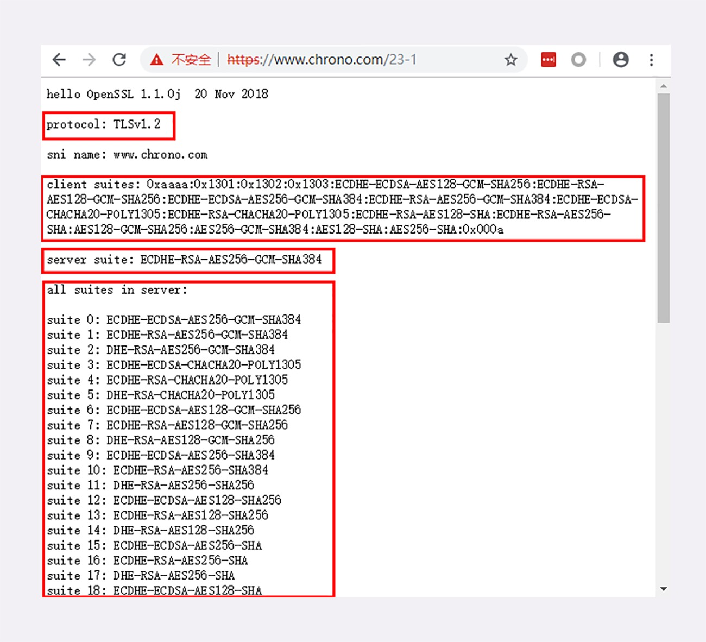

# HTTPS 简介

> #### 为什么会有 HTTPS ？

 “HTTPS” 出现的原因是因为 “HTTP不安全” 的因素，在 HTTP 章节有提到 HTTP协议 有 “无状态”、“明文传输”、“不安全” 等特点，其中 “无状态” 因为 “Cookie” 的出现得到解决，但是 “明文传输”、“不安全” 等特点 “HTTP” 自身是无法解决的，为了适应当前互联网的大环境，所以才引入了 “HTTPS”

 “HTTP” 天生 “明文” 的特点使得传输的数据在整个传输过程都是可见的。在传输的链路中数据又可能被 “拦截”、“篡改”、“伪造请求/响应报文” 等 “不安全” 的问题， “HTTP” 又显的无能为力，它导致传输的数据不可信性，这种情况对于 网络购物、网上银行、证券交易等需要高度信任的应用场景来说是致命的。

 对于安全性不是那么高的新闻、视频、搜索等网站来说，由于互联网的恶意用户、恶意代理越来越多，也很容易导致 “流量劫持” 的攻击，在页面里强行嵌入广告、分流用户等导致各种理由损失

 在没有 HTTPS 的世界里，网民上网的记录容易被人截取，网站的真伪很难验证，黑客可以伪装成银行网站等盗取真正姓名、密码、银行卡等敏感信息，威胁人身安全和财产安全

> #### 什么是通信的安全性 ？

通常认为如果通信具备了如下4个特征就认为是 “安全” 的：

1、“**机密性**”：表示数据在传输的过程中是加过密的，旁人看不懂是什么东西

2、“**完整性**”：也可以说是 “一致性” ，表示数据在传输的过程中是否有被篡改，完整的保持原样

3、“**身份认证**”：是指确认对方的真实身份，“证明你是你”，保证消息只能发送可信的人

4、“**不可否认**”：表示不可抵赖，不能否认已经发生过的行为，不能说话不算数等

> #### 什么是 HTTPS ？

着重点讲 “HTTPS” 主要是对 “HTTP” 的 “安全性” 方向进行了升级，“HTTPS” 协议在 “协议名称”、“端口号（默认：443）”、“文明传输”、“安全性” 等方面上做了修改，至于请求模式、请求方法、报文结构、头字段等基本都是照单全收。

HTTPS 能够鉴别危险的网站，并且尽最大的可能保证你的上网安全，防御黑客对信息的窃听、篡改、钓鱼、伪造等。不知道你有没有注意，在用 “Chrome” 访问 “HTTP” 域名的网站时会有不安全的提示，必须点击 “ 高级-- 继续往前” 才能显示页面，这就是上面所说的最好的体现

“HTTPS” 与 “HTTP” 看上去只有一个 “S” 的区别，但区别主要就在这个 “S” 上，它把 “HTTP over TCP/IP” 改造成了 “HTTP over SSL/TLS” , 让 “HTTP” 运行在了 “SSL/TLS” 安全协议上，收发报文不再使用 Scoket API , 而是使用专门的安全接口。

看了图就知道了，其实 “HTTP” 还是原来的 “HTTP”，只是跑着在了 “SSL/TLS” 上，看来要搞懂 “HTTPS” 必须的先知道 “SSL/TLS” 是怎么回事。

> #### SSL/TLS

SSL（Secure Sockets Layer）是安全套接层，网景公司在 1994 年发明，公开的版本有 v2、v3 两个版本，其中 v1 有严重的缺陷从未公开过

由于 SSL 发展到 v3 的时候是一个非常好的安全通信协议，所以互联网工程组 IETF 在 1999 年正式把它标准化，改名为 TLS （传输安全、Transport Layer Security），版本号从 1.0 开始，实际就是 SSL v3.1 

TLS 发展到今天已经有3个版本了（1.1、1.2、1.3），其中 1.2 是目前使用最广泛的的版本，都目前都已经被认为是不安全的，各大浏览器即将在 2020 年左右停止对它的支持

TLS 由 记录协议、握手协议、警告协议、变更密码规范协议、扩展协议等几个子协议组成，综合使用了 对称加密、非对称加密、身份认证等许多密码学的前沿技术。浏览器和服务器在使用 TLS 建立连接时需要选择一组恰当的加密算法了实现安全通信、这些算法的组合被称为 “密码套件” 或 “加密套件”

通过上图可以看到：环境使用的 TLS 是 1.2，客户端和服务器都支持非常多的密码套件，而最后协商选定的是  “**ECDHE-RSA-AES256-GCM-SHA384**” ，其中：

**ECDHE** ：表示握手时使用 ECDHE 算法进行密钥交换

**RSA** ：表示用 RSA 签名和身份认证

**AES256**：表示握手后的通信使用 AES 对称算法，密钥长度 256 位

**GCM**：表示分组模式是 GCM

**SHA384**：表示摘要算法 SHA384 用于消息认证和产生随机数

基本的形式是：秘钥交换算法 + 签名算法 + 对称加密算法 + 分组模式 + 摘要算法

> #### OpenSSL

OpenSSL 是一个著名的密码学程序库和工具包，几乎支持所有公开的密码和协议，已经成为事实的标准，许多应用软件都会使用它作为底层库来实现 TLS 功能，包括 常用的 WEB 服务器 Apache、Nginx 等