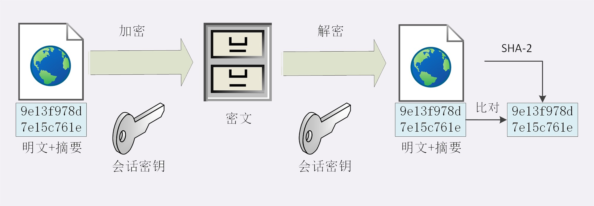
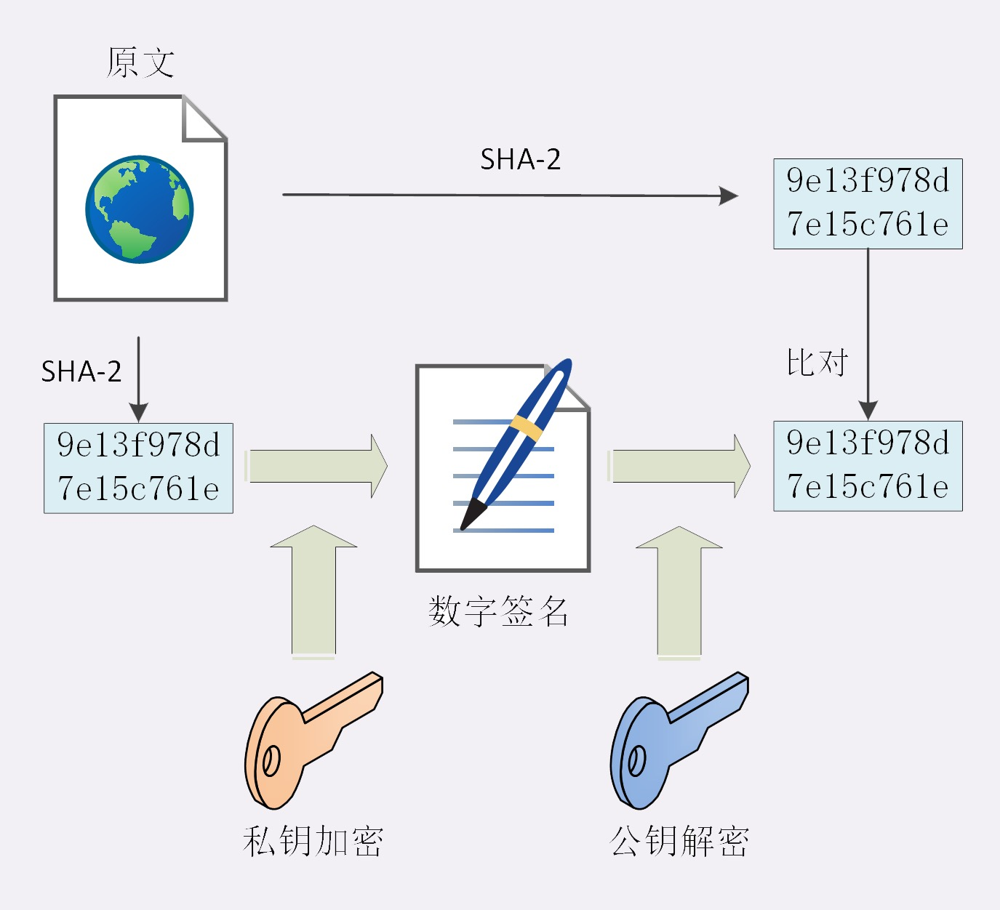
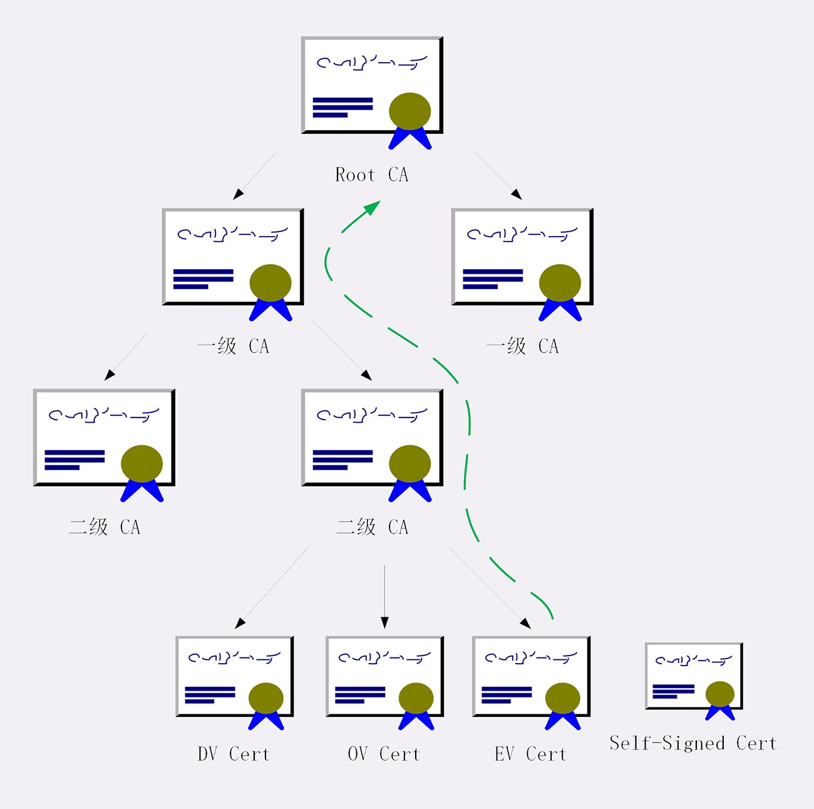

# HTTPS 签名与证书

算法虽然保证了传输信息的机密性，但是对于安全而言这是远远不够的。黑客也许无法破解传输的密文，但是你不能保证他通过窃听收集足够多的密文，然后尝试修改、重组后发给服务器，因为没有完整性保证，服务器只能 “照单全收”，然后通过服务器的响应获取进一步的线索，最终破解除明文等

还有，黑客可以充当 “**中间者**” 伪造身份，截获了真正的公钥，然后发给客户端一个假公钥，服务端发了信息，黑客通过真正的公钥解密，然后又通过自己的私钥加密信息发给客户端，客户端又通过假的公钥解密，这样其实客户端是在跟黑客通信，而客户端自己却完全不知道。就这样黑客窃取了你的 银行卡、密码等后果不堪设想。

所以为了保障用户的财产安全，必须要在机密性的基础上加上 “完整性”、“身份认证” 等特性才能实现真正的安全

> #### 摘要算法

实现完整性的主要手段就是 “**摘要算法（Digest Algorithm）**”，就是常说的 散列函数、哈希函数

摘要算法它能把任意长度的数据 “压缩” 成一个固定长度且独一无二的字符串，简称 “**摘要**”，它就像给这段数据生成了一个数字 “**指纹**”，唯一标识着这段数据

好的摘要算法必须要具备 “单向性”、“抵抗冲突”、“雪崩效应” 等特性：

1、“**单向性**” 就是说转换之后的 “摘要” 不能被还原出原文，具备不可逆性

2、“**抵抗冲突**” 就是说转换之后的 “摘要” 能抵抗冲突，不能说有两分原文转换出相同的 “摘要”，尽量确保 “摘要” 唯一性

3、“**雪崩效应**” 就是说两份差别微小的原文数据转换之后的 “摘要” 有很大的不同，微小差别导致剧烈的变化

工作种常见的摘要算法有：“MD5（Message-Digest 5）”，“SHA-1（Secure Hash Algorithm 1）” 它们能生成 16、20个字节长度的数字摘要，但是这两个算法的安全度比较低，在 TSL 里面已经禁止使用

目前 TSL 推荐使用 “**SHA-2**”，它是一系列的统称，比较常用的有：“**SHA224**”，“**SHA256**”，“**SHA384**”，它们分别生成 28 、32、48个字节的摘要

> #### 完整性

有了 摘要算法 就能保证数据的完整性或一致性，通过 “**摘要算法**” 计算出原文的 “摘要”，只要原文有一点细微的变化，计算的出来的 “摘要” 将会发生 “**雪崩效应**” 

在传输前，客户端先计算出原文的 “**摘要**”，然后将摘要附加再原文上，让后再用公钥加密传给服务器，服务器用私钥解密取出原文、摘要，再用摘要算法计算出原文的 “**摘要**”，对比前后两次 “**摘要**” 验证传输报文的完整性或一致性

这里要注意的是 “**摘要**” 是不具备机密性的，所以 “**摘要**” 必须要随原文一起加密，否则可能被黑客一起窃取更换就没有任何意义了

> #### 数字签名

有了 “摘要算法” 与 “加密算法” 再通信过程种就是比较安全了，但是这里有个漏洞就是通信的两个端点（客户端、服务端），也就是说你无法认证 “客户端” 与 “服务端” 是真实的，因为黑客可以伪装成 “客户端” 与 “服务端”，那你如何识别这两个端是真正的 “客户端” 与 “服务端” 呢 ？

在现实生活中我们都通过 签名、印章来证明自己的身份，只要在纸上写下自己的名字 或 盖上自己的印章，就能证明这份文件确实是由本人而不是他人所签发的

而在 “TSL” 中只有 “**私钥**”（非对称加密） 和 现实中的 “**印章**” 很像，它只能是自己本人持有，其他人是不会有自己的 “**印章**”，所以它同样可以在数字世界中证明自己的身份

现实世界中的 “**印章**” 是用来 “**盖**” 的， 那么 “TSL” 中的 “**私钥**” 肯定是用来“**加密**”的，但又因为 “非对称加密” 效率很低，而报文的 “摘要” 长度小又 “等价” 报文，有利于减少加密计算量，同时加密后的字符串也很小，所以比较适合保管与传输

所以如果用 “**私钥**” 加密报文的 “**摘要**”传给客户端，而客户端用 “**公钥**” 解密报文的 “**摘要**”，验证报文的完整性，这样不就像现实世界签发的文件一样证明了消息确实是你发的，同时实现了 “**身份认证**” 和 “**不可否认**” 特性

利用非对称加密算法的 私钥 加密 报文的 摘要 后产生的字符串叫 “**数字签名**”

> #### 数字证书

目前已经使用 对称加密、非对称加密、摘要算法 实现了完全的四大特性，是不是已经完美了呢 ？

答案还是否定的，这里有一个 “**公钥的信任**” 问题，因为谁都可以发布公钥，那么我们怎样防止黑客伪造公钥呢 ？

要解决这个问题，我们就得从 “**公钥**” 来源入手，“公钥” 来于服务器传给客户端的 “证书”，而 “证书” 是由CA（Certificate Authority）机构颁发证书给服务器的，证书上大概包容如下信息：

1、“签发者”、

2、“证书用途”、

3、“公钥”、

4、“加密算法”、

5、“Hash算法”、

6、“有效期” 

7、“申请人相关信息等”

CA机构为了解决这个问题，利用自身的信誉来给 公钥 做 “签名认证”，它把证书相关的 “序列号”、“签发者”、“证书用途”、“公钥” 等相关信息做了打包 ，然后给打包后的数据利用摘要算法生成 “摘要”，最后用 私钥 对 “摘要” 做了加密，形成 “**数字签名**”，然后把这个 “数字签名” 附加到证书的末尾形成 **数字证书**，然后把证书颁发给了服务器。当客户端接收到服务器传给它的证书之后用公钥解密 “数字签名”，然后做信息完整性验证，至此实现身份认证和不可否认

> #### 证书认证机构（Certificate Authority 简称 CA）

CA机构又称 SSL证书颁发机构，是一个可信的数字证书颁发实体，是互联网公钥基础结构（PKI）的重要组成部分。每年SSL证书机构都会颁发出数百万个SSL证书，这些证书在保护网站信息安全、加密并实现安全通信等方面，发挥了重要作用。颁发机构必须遵从行业规则的约束，需要入根到各大浏览器、操作系统和移动设备程序中。

证书认证机构就像现实世界的的 “公安局”、“公证中心” 一样，具有极高的可信度，它可以颁发证书，认证公钥的真伪。目前全世界比较知名的CA机构就那么几家，比如：DigCert、VeriSign、Entrust，他们签发的证书分为如下几种：

1、**DV**：目前市面上的免费证书都是这个类型的，只是提供了对数据的加密，但是对提供证书的个人和机构的身份不做验证

2、**OV**：提供了对个人或者机构的审核，能确认对方的身份，安全性更高。所以这部分的证书申请是收费的

3、**EV**：是目前业界安全最高的级别，遵循全球统一的严格身份验证标准，经过了法律、审计的严格核查，可以证明网站的拥有者身份，比如在 浏览器地址栏显示出公司名称等，申请费用也是最贵的

证书可以找相关CA证明，那么 CA 怎么证明自己呢 ？

这就是信任链的问题，小一点的CA可以找大一点的 CA 验证签名，到最后的就是 ROOT CA , 而 ROOT CA 就只能自己证明自己，这就是所谓的 “**自签名证书**” 或 “**根证书**” ，到了这一步你就必须相信，否则整个信任链就走不下去

有了这个证书体系，操作系统和浏览器都内置了各大CA的根证书，上网的时候只要服务器发过来它的证书，就可以验证证书里面的签名，顺着证书链一层一层的验证，直到找到根证书，能够确定证书是可信的，从而里面的公钥也是可信的

**证书体系（PKI，Public Key Infrastructure）** 虽然是目前整个网络世界的安全基础设施，但绝对的安全是不存在的，它也有弱点，还是关键的“**信任**”二字。

**第一种情况** 如果 CA 失误或者被欺骗，签发了错误的证书，虽然证书是真的，可它代表的网站却是假的。

**第二种情况** 更危险的情况，CA 被黑客攻陷，或者 CA 有恶意，因为它（即根证书）是信任的源头，整个信任链里的所有证书也就都不可信了。

这两种事情并不是“耸人听闻”，都曾经实际出现过。所以，需要再给证书体系打上一些补丁。

**针对第一种**，开发出了 CRL（证书吊销列表，Certificate revocation list）和 OCSP（在线证书状态协议，Online Certificate Status Protocol），及时废止有问题的证书。

**对于第二种**，因为涉及的证书太多，就只能操作系统或者浏览器从根上“下狠手”了，撤销对 CA 的信任，列入“黑名单”，这样它颁发的所有证书就都会被认为是不安全的。小结

