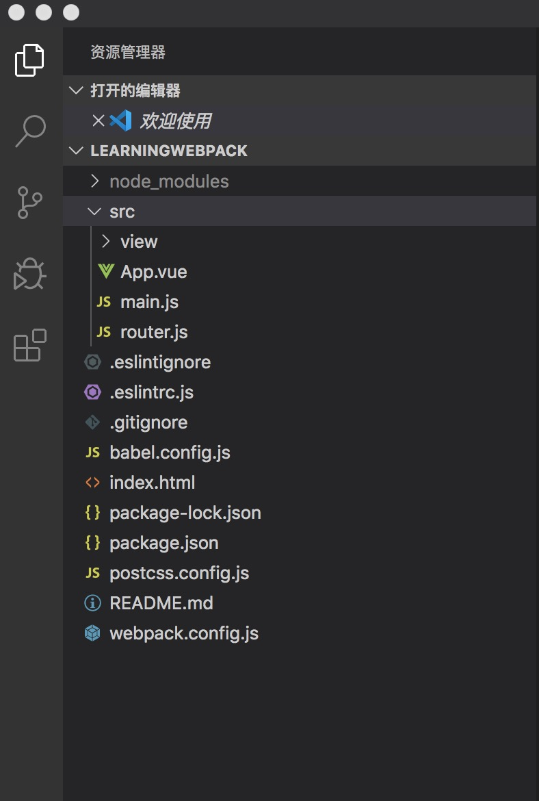
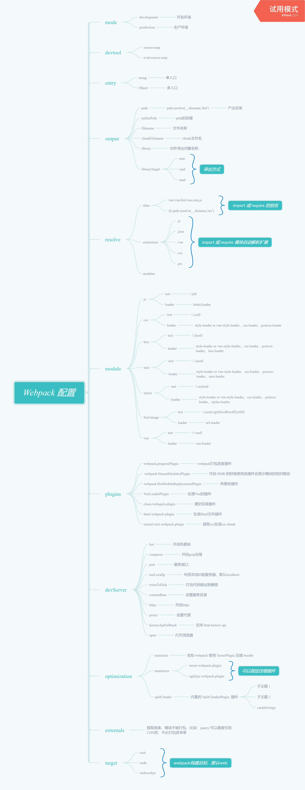

# Webpack 配置


1、安装 webpack、webpack-cli、webpack-dev-server

```javascript
npm install -g cnpm --registry=http://registry.npm.taobao.org

cnpm install -D webpack webpack-cli webpack-dev-server
```

2、安装 vue、vue-router

```javascript
cnpm install -D vue vue-router
```
3、工程目录结构如下



4、webpack 配置（基于webpack4.x版本）

```javascript
const path = require('path')
const webpack = require('webpack')
const VueLoaderPlugin = require('vue-loader/lib/plugin')
const HtmlWebpackPlugin = require('html-webpack-plugin')
const { CleanWebpackPlugin } = require('clean-webpack-plugin')

module.exports = {
  mode: 'development', // 配置开发环境，生产环境是 production
  entry: {
    main: './src/main.js' // 配置入口文件
  },
  output: {
    publicPath: '/', //配置产出目录的前缀
    path: path.resolve(__dirname, 'dist'), // 配置产出目录
    filename: 'js/[name].js', // 配置产出的js文件
    chunkFilename: 'js/[name].js' // 配置提取的 chunk 文件
  },
  resolve: {
    // 当用import、require引入模块的时候可以省略模块后缀
    // 默认是 .js、.json , 这里扩张了一些
    // 默认从vue开始查找以次到最后
    extensions: ['.vue', '.js', '.css', '.json','.html'],
    alias: { // 别名
      '@': path.resolve(__dirname, 'src'), // 用@代替src, 提高易用性
      vue: 'vue/dist/vue.esm.js' // import vue 是导入的真正源码
    }
  },
  devServer: {
    hot: true, // 启用热更新
    compress: true, // 启用gzip压缩
    open: true, // 打开默认浏览器
    port: 8787, // 服务器端口
    writeToDisk: true, // 却不打包资源输出的硬盘，不是在内存中
    historyApiFallback: true, // 开启 html5 的 history API ， 默认是hash
    contentBase: path.resolve(__dirname, 'dist') // 服务器目录
  },
  module: {
    rules: [
      {
        // 匹配js文件
        test: /\.js$/,
        // 此处要安装 @babel/core、@babel/preset-env、babel-loader的依赖，具体配置在 babel.config.js 文件
        use: ['babel-loader']  
      },
      {
        // 匹配vue文件
        test: /\.vue$/,
        // 此处要安装 vue-loader
        use: ['vue-loader']
      },
      {
        // 匹配css文件
        test: /\.css$/,
        // 此处要安装 'vue-style-loader', 'css-loader', 'postcss-loader'
        // 其中 postcss-loader 依赖 autoprefixer 插件，需要安装
        // postcss-loader 默认启用 postcss.config.js文件配置
        use: ['vue-style-loader', 'css-loader', 'postcss-loader']
      },
      {
        // 匹配less文件
        test: /\.less$/,
        // 此处要安装 'vue-style-loader', 'css-loader', 'postcss-loader', 'less-loader'
        // 其中 postcss-loader 依赖 autoprefixer 插件，需要安装
        // postcss-loader 默认启用 postcss.config.js文件配置
        use: ['vue-style-loader', 'css-loader', 'postcss-loader', 'less-loader']
      },
      {
        // 匹配stylus文件
        test: /\.stylus$/,
        // 此处要安装 'vue-style-loader', 'css-loader', 'postcss-loader', 'stylus-loader'
        // 其中 postcss-loader 依赖 autoprefixer 插件，需要安装
        // postcss-loader 默认启用 postcss.config.js文件配置
        use: [
          'vue-style-loader',
          'css-loader',
          'postcss-loader',
          'stylus-loader'
        ]
      },
      {
        // 匹配图片
        test: /\.(png|jpg|jpeg|gif)$/,
        // 此处要安装 url-loader ， 而 url-loader 又依赖 file-loader，所以要安装file-loader
        use: [
          {
            loader: 'url-loader',
            options: {
              limit: 5 * 1024, // 5KB以内的图片转化成base64
              name: 'images/[name].[ext]' // 图片具体的输出
            }
          }
        ]
      },
      {
        // 匹配图片
        test: /\.(eot|svg|ttf|woff|woff2|otf)$/,
        // 此处要安装 url-loader ， 而 url-loader 又依赖 file-loader，所以要安装file-loader
        use: [
          {
            loader: 'url-loader',
            options: {
              limit: 5 * 1024,// 5KB以内的图片转化成base64
              name: 'fonts/[name].[ext]'// 字体文件具体的输出
            }
          }
        ]
      }
    ]
  },
  plugins: [
    new CleanWebpackPlugin(), // 每次打包之前情况服务目录
    new webpack.ProgressPlugin(), // 打包的进度信息，webpack内置插件
    new webpack.NamedModulesPlugin(), // 热更新后会产出一个更新模块的现对路径，要不要都可以
    new webpack.HotModuleReplacementPlugin(), // 支持热更新插件
    new VueLoaderPlugin(), // 处理vue文件插件
    new HtmlWebpackPlugin({ // 生成html文件插件
      template: './index.html',
      filename: 'index.html',
      alwaysWriteToDisk: true,
      reject: true
    })
  ],
  optimization: { // webpack 4.0 优化配置
    splitChunks: { // splitChunksPlugin插件
      cacheGroups: { // 配置缓存组
        commons: {
          // 单独抽取node_modules下的依赖作为一个chunk，名字叫 venders
          test: /[\\/]node_modules[\\/](vue|vue-router|element-ui)[\\/]/,
          name: 'vendors',
          chunks: 'all'
        }
      }
    }
  }
}
```

5、接入 Eslint

a、安装 Eslint

```javascript
cnpm install -D eslint
```

b、初始化 eslint 配置文件

```javascript
mac: ./node_modules/.bin/ellint --init

win cmd: .\node_modules\.bin\eslint -init
```

c、安装 依赖

```javascript
  "eslint-config-standard": "^14.1.0",

  "eslint-plugin-import": "^2.20.1",

  "eslint-plugin-node": "^11.0.0",

  "eslint-plugin-promise": "^4.2.1",

  "eslint-plugin-standard": "^4.0.1",

  "eslint-plugin-vue": "^6.2.1",
```

6、常用配置思维导图




